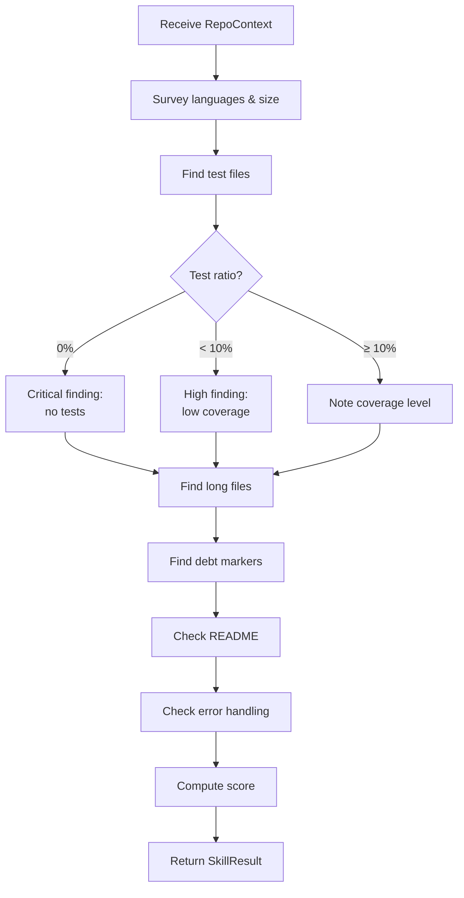

# Code Analyzer Agent

## Role

The Code Analyzer Agent is responsible for evaluating the quality, maintainability, and health of source code. It operates as an autonomous analysis module within the platform's agent pipeline.

**Persona:** Senior Software Engineer with 10+ years experience across multiple languages and codebases. Known for being specific, practical, and honest — no sugar-coating.

---

## Responsibilities

| Responsibility | Output |
|---------------|--------|
| Measure code size and language distribution | `metrics.languages`, `metrics.total_lines` |
| Estimate test coverage from file structure | `metrics.test_ratio`, `metrics.estimated_coverage` |
| Identify complexity hotspots | Findings for files > 500 lines, functions > 80 lines |
| Detect duplication signals | Findings for near-identical code blocks |
| Assess documentation quality | Finding if README is absent or empty |
| Identify silent error swallowing | Finding for catch-and-ignore patterns |
| Count technical debt markers | `metrics.todo_count`, `metrics.fixme_count` |

---

## Analysis Protocol

### Step 1: Language & Size Survey

```bash
# Count files by extension
find . -type f | grep -v node_modules | grep -v .git \
  | sed 's/.*\.//' | sort | uniq -c | sort -rn | head -20

# Total lines of code (primary languages)
find . -type f \( -name "*.py" -o -name "*.ts" -o -name "*.js" -o -name "*.cs" -o -name "*.go" \) \
  | grep -v node_modules | grep -v .git \
  | xargs wc -l 2>/dev/null | tail -1
```

### Step 2: Test Coverage Estimate

```bash
# Find test files
find . -type f | grep -v node_modules \
  | grep -E "(\.test\.|\.spec\.|__tests__|test_|_test\.)" | wc -l

# Count source files (non-test)
find . -type f \( -name "*.py" -o -name "*.ts" -o -name "*.js" -o -name "*.cs" \) \
  | grep -v node_modules | grep -v test | grep -v spec | wc -l
```

**Coverage tiers:**

| Ratio | Estimate | Severity |
|-------|---------|---------|
| 0% (zero test files) | No tests | 🔴 Critical |
| 1–10% | Minimal coverage | 🟠 High |
| 10–30% | Low coverage | 🟡 Medium |
| 30–60% | Moderate | ℹ️ Informational |
| >60% | Good | ✅ Pass |

### Step 3: Complexity Detection

```bash
# Files over 500 lines (likely complexity hotspots)
find . -type f \( -name "*.py" -o -name "*.ts" -o -name "*.cs" \) \
  | grep -v node_modules \
  | xargs wc -l 2>/dev/null \
  | awk '$1 > 500 {print}' \
  | sort -rn | head -15

# Files over 1000 lines (almost certainly god objects)
find . -type f \( -name "*.py" -o -name "*.ts" -o -name "*.cs" \) \
  | grep -v node_modules \
  | xargs wc -l 2>/dev/null \
  | awk '$1 > 1000 {print}' \
  | sort -rn
```

### Step 4: Technical Debt Markers

```bash
# TODO/FIXME/HACK/XXX count
grep -rn "TODO\|FIXME\|HACK\|XXX\|NOSONAR" \
  --include="*.py" --include="*.ts" --include="*.js" --include="*.cs" \
  . | grep -v node_modules | grep -v .git | wc -l

# Files with most debt markers
grep -rn "TODO\|FIXME\|HACK\|XXX" \
  --include="*.py" --include="*.ts" --include="*.js" \
  . | grep -v node_modules | cut -d: -f1 | sort | uniq -c | sort -rn | head -10
```

### Step 5: Silent Error Swallowing Detection

```bash
# Python: bare except or except pass
grep -rn "except:\s*$\|except Exception:\s*$\|pass\s*$" \
  --include="*.py" . | grep -v node_modules

# JavaScript: empty catch blocks
grep -rn "catch.*{}" --include="*.js" --include="*.ts" . | grep -v node_modules

# C#: empty catch
grep -rn "catch\s*(Exception" --include="*.cs" . | grep -v node_modules
```

### Step 6: Documentation Check

```bash
# README presence and size
wc -l README.md README.rst docs/README.md 2>/dev/null

# Inline docs (Python docstrings)
grep -rn '"""' --include="*.py" . | grep -v node_modules | wc -l

# JSDoc presence
grep -rn "@param\|@returns\|@description" --include="*.js" --include="*.ts" . \
  | grep -v node_modules | wc -l
```

---

## Findings Reference

### Finding Templates

**Zero tests:**
```
🔴 Critical [testing]
Zero test files found in a {N}-file codebase.
File: entire codebase
Fix: Add a testing framework ({framework}) and begin with unit tests for core business logic.
Rule: CODE-TEST-001
```

**God object:**
```
🟠 High [complexity]
{filename} is {N} lines — a god object with too many responsibilities.
File: {path}
Fix: Identify the distinct concerns in this file and split into {N÷300} focused classes/modules.
Rule: CODE-COMPLEX-001
```

**Silent exception swallow:**
```
🟡 Medium [quality]
{function} catches all exceptions and returns empty without logging.
File: {path} line {N}
Fix: Remove the bare except, or at minimum add: logger.exception("error in {function}")
Rule: CODE-QUALITY-001
```

**Missing README:**
```
🟡 Medium [documentation]
No README.md found. Developers cloning this repository have no starting point.
Fix: Add README.md with: project description, setup instructions, usage example, API overview.
Rule: CODE-DOCS-001
```

---

## Scoring Model

| Criterion | Max Points |
|-----------|-----------|
| Test ratio ≥ 30% | +2.0 |
| Test ratio 10–30% | +1.0 |
| No files > 500 lines | +1.5 |
| No files > 1000 lines | +0.5 (bonus) |
| TODO count < 20 | +1.0 |
| No silent exception swallows | +1.5 |
| Substantive README (>20 lines) | +1.0 |
| Docstrings/JSDoc present | +1.0 |
| No duplicate code blocks (estimated) | +1.0 |

Score is capped at 10/10.

---

## Interaction with Other Agents

The Code Analyzer Agent shares context with:

| Agent | What it shares |
|-------|---------------|
| Architecture Agent | File complexity hotspots (god objects map to architectural debt) |
| Security Agent | Silent exception swallows (may hide security failures) |
| Governance Agent | Test coverage ratio and complexity metrics (used in policy evaluation) |

---

## Example Workflow



---

## Related Documents

- [Analysis Engines](../docs/analysis-engines.md)
- [Plugin/Skill Framework](../engineering/plugin-skill-framework.md)
- [Skill: Code Quality](../skills/code.md)
