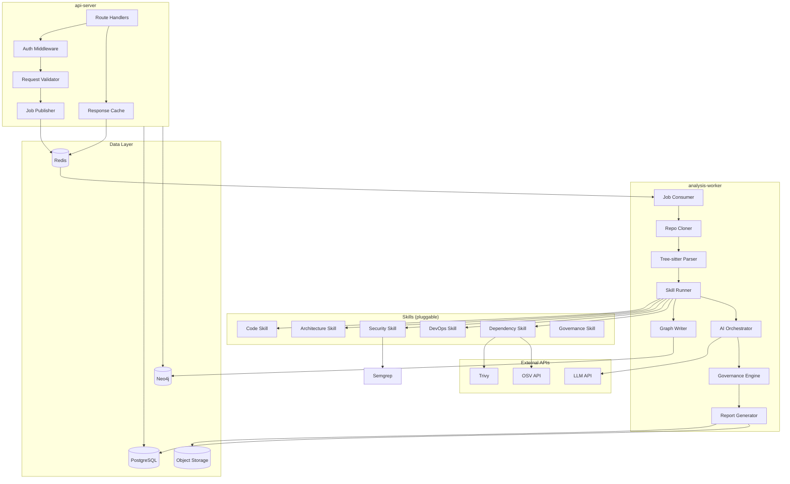

# Component Architecture

## Component Map



---

## API Server Components

### Route Handlers
Thin controllers that validate requests, delegate to services, and return responses. No business logic.

```python
# src/api/routes/analyses.py
@router.post("/analyses", response_model=AnalysisCreated, status_code=202)
async def create_analysis(
    body: CreateAnalysisRequest,
    current_user: User = Depends(get_current_user),
    job_service: JobService = Depends()
):
    job = await job_service.enqueue_analysis(
        repo_url=body.repo_url,
        skills=body.skills,
        user_id=current_user.id
    )
    return AnalysisCreated(analysis_id=job.id, status="queued")
```

### Auth Middleware
JWT validation on every request. API keys are also supported for CI/CD integrations.

```python
async def get_current_user(
    token: str = Depends(oauth2_scheme),
    db: AsyncSession = Depends(get_db)
) -> User:
    payload = decode_jwt(token)
    user = await db.get(User, payload["sub"])
    if not user or not user.is_active:
        raise HTTPException(status_code=401)
    return user
```

### Job Publisher
Publishes `AnalysisJob` messages to the Redis queue with priority routing.

---

## Analysis Worker Components

### Repo Cloner
Handles all git operations with retry logic and size-based strategy selection:

```python
class RepoCloner:
    async def clone(self, repo_url: str, dest: Path) -> CloneResult:
        strategy = self._select_strategy(repo_url)
        match strategy:
            case CloneStrategy.FULL_SHALLOW:
                return await self._shallow_clone(repo_url, dest)
            case CloneStrategy.SPARSE:
                return await self._sparse_clone(repo_url, dest)
```

### Tree-sitter Parser
Multi-language parser producing a normalized `ParsedRepo`:

```python
class TreeSitterParser:
    LANGUAGE_MAP = {
        ".py":  "python",
        ".ts":  "typescript",
        ".js":  "javascript",
        ".cs":  "c_sharp",
        ".go":  "go",
        ".java":"java",
        ".rb":  "ruby",
        ".rs":  "rust",
    }

    def parse_file(self, path: Path) -> ParsedFile:
        language = self.LANGUAGE_MAP.get(path.suffix)
        if not language:
            return ParsedFile(path=path, language="unknown", ast=None)

        tree = self.parsers[language].parse(path.read_bytes())
        return ParsedFile(
            path=path,
            language=language,
            functions=self._extract_functions(tree),
            classes=self._extract_classes(tree),
            imports=self._extract_imports(tree),
        )
```

### Skill Runner

Executes all enabled skills in parallel with timeout and error isolation:

```python
class SkillRunner:
    def __init__(self, skills: list[Skill], timeout: int = 120):
        self.skills = skills
        self.timeout = timeout

    async def run_all(self, context: RepoContext) -> list[SkillResult]:
        tasks = [
            asyncio.wait_for(
                skill.analyze(context),
                timeout=self.timeout
            )
            for skill in self.skills
        ]

        results = []
        for task, skill in zip(
            asyncio.as_completed(tasks), self.skills
        ):
            try:
                result = await task
                results.append(result)
            except asyncio.TimeoutError:
                results.append(SkillResult.timeout(skill.name))
            except Exception as e:
                results.append(SkillResult.error(skill.name, str(e)))

        return results
```

### Graph Writer

Writes analysis results to Neo4j in a single transaction:

```python
class GraphWriter:
    async def write_analysis(
        self,
        run: AnalysisRun,
        results: list[SkillResult]
    ) -> None:
        async with self.driver.session() as session:
            await session.execute_write(
                self._write_tx, run, results
            )
```

### AI Orchestrator

Manages the prompt → LLM call → parse → cache cycle:

```python
class AIOrchestrator:
    async def synthesize(
        self,
        findings: list[Finding],
        metadata: RepoMetadata
    ) -> AISynthesis:
        cache_key = compute_cache_key(findings, metadata)

        if cached := await self.cache.get(cache_key):
            return AISynthesis.from_json(cached)

        prompt = self.prompt_builder.build(findings, metadata)
        response = await self.llm.complete(prompt)
        synthesis = self.parser.parse(response)

        await self.cache.set(cache_key, synthesis.to_json(), ttl=86400)
        return synthesis
```

---

## Skill Component Interface

Every skill implements the same interface:

```python
class Skill(ABC):
    @property
    @abstractmethod
    def name(self) -> str: ...

    @property
    @abstractmethod
    def weight(self) -> float: ...  # contribution to overall score

    @abstractmethod
    async def analyze(self, context: RepoContext) -> SkillResult: ...

    def score(self, findings: list[Finding]) -> int:
        """Default scoring: start at 10, subtract per finding"""
        deductions = {
            "critical": 3.0,
            "high": 1.5,
            "medium": 0.5,
            "low": 0.1
        }
        total = sum(deductions[f.severity] for f in findings)
        return max(0, min(10, round(10 - total)))
```

---

## Report Generator

Produces all output formats from a single `ReportContext`:

```python
class ReportGenerator:
    def __init__(self, templates_dir: Path):
        self.env = jinja2.Environment(
            loader=jinja2.FileSystemLoader(templates_dir)
        )

    def generate_markdown(self, ctx: ReportContext) -> str:
        template = self.env.get_template("report.md.j2")
        return template.render(ctx.to_dict())

    def generate_html(self, ctx: ReportContext) -> str:
        template = self.env.get_template("report.html.j2")
        return template.render(ctx.to_dict())

    def generate_json(self, ctx: ReportContext) -> dict:
        return ctx.to_dict()
```

---

## Data Models

```python
@dataclass
class RepoContext:
    repo_url: str
    local_path: Path
    metadata: RepoMetadata
    parsed_repo: ParsedRepo
    import_graph: ImportGraph

@dataclass
class SkillResult:
    skill_name: str
    status: Literal["complete", "timeout", "error"]
    findings: list[Finding]
    metrics: dict[str, Any]
    score: int
    elapsed_ms: int

@dataclass
class Finding:
    id: str
    severity: Literal["critical", "high", "medium", "low"]
    category: str
    title: str
    detail: str
    file_path: str | None
    line_number: int | None
    fix: str
    rule_id: str
    skill: str

@dataclass
class ReportContext:
    repo_url: str
    analyzed_at: datetime
    skill_results: list[SkillResult]
    ai_synthesis: AISynthesis | None
    governance_result: GovernanceResult
    overall_score: float
```

---

## Related Documents

- [High-Level Architecture](high-level-architecture.md)
- [Microservices Architecture](microservices-architecture.md)
- [System Design](../docs/system-design.md)
- [Plugin/Skill Framework](../engineering/plugin-skill-framework.md)
