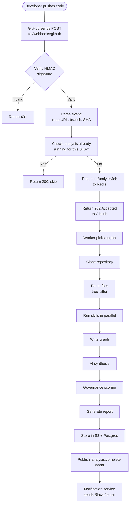
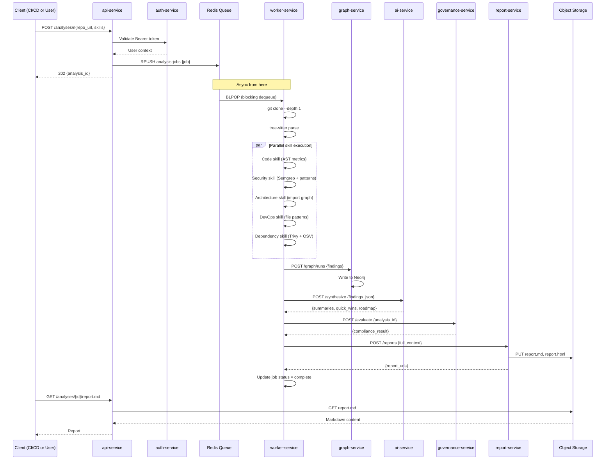

# Data Flow

## End-to-End Data Flow

This document traces the exact path data takes through the system from a raw repository URL to a delivered report.

---

## Flow 1: Webhook-Triggered Analysis



---

## Flow 2: On-Demand API Analysis



---

## Data Transformations at Each Stage

### Stage 1: Webhook → Job

```
Input:  GitHub webhook POST body (JSON)
        {
          "ref": "refs/heads/main",
          "repository": {"clone_url": "https://github.com/org/repo.git"},
          "head_commit": {"id": "abc123"}
        }

Output: AnalysisJob (Redis message)
        {
          "job_id": "job_01HXYZ",
          "repo_url": "https://github.com/org/repo.git",
          "branch": "main",
          "commit_sha": "abc123",
          "skills": ["all"],
          "priority": "high",
          "created_at": "2026-03-12T10:00:00Z"
        }
```

### Stage 2: Clone → ParsedRepo

```
Input:  AnalysisJob {repo_url, branch}
        Git credentials from Secrets Manager

Output: RepoContext
        {
          "local_path": "/tmp/analysis/job_01HXYZ/repo",
          "metadata": {
            "total_files": 312,
            "total_lines": 24800,
            "primary_language": "Python",
            "languages": {"Python": 180, "YAML": 45, "Markdown": 12}
          },
          "file_tree": [
            {"path": "src/api/routes.py", "lines": 245, "language": "Python"},
            ...
          ]
        }
```

### Stage 3: ParsedRepo → Findings

```
Input:  RepoContext (after tree-sitter parsing)

Output: list[Finding] (all skills merged)
        [
          {
            "id": "fnd_abc",
            "severity": "critical",
            "category": "secrets",
            "title": "AWS Access Key committed",
            "file_path": "config/aws.py",
            "line_number": 12,
            "fix": "Remove and rotate immediately",
            "rule_id": "SEC-SECRETS-001",
            "skill": "security"
          },
          ...
        ]
```

### Stage 4: Findings → Neo4j Graph

```
Input:  list[Finding] + RepoContext

Neo4j writes:
  (:Repository {url: "..."})
  (:AnalysisRun {id: "...", score: 6.2})
  (:File {path: "config/aws.py", lines: 45})
  (:Finding {severity: "critical", ...})

  (:Repository)-[:HAS_RUN]->(:AnalysisRun)
  (:AnalysisRun)-[:PRODUCED]->(:Finding)
  (:Finding)-[:LOCATED_IN]->(:File)
```

### Stage 5: Findings JSON → AI Synthesis

```
Input:  Top 50 findings (JSON), repository metadata

Prompt: Structured prompt template populated with findings

LLM Response (parsed JSON):
        {
          "executive_summary": "...",
          "skill_summaries": {"security": "...", "code": "..."},
          "quick_wins": [...],
          "roadmap": {"this_week": [...], ...}
        }
```

### Stage 6: All Results → Governance Score

```
Input:  SkillResults (scores + metrics per skill)
        PolicyRuleset (configured policies)

Output: GovernanceResult
        {
          "is_compliant": false,
          "governance_score": 3.5,
          "blocking_violations": ["SEC-001"],
          "advisory_violations": ["CODE-001", "DEVOPS-001"],
          "passed": ["DEP-002", "ARCH-001"]
        }
```

### Stage 7: All Context → Report

```
Input:  RepoContext + SkillResults + AISynthesis + GovernanceResult

Output:
  report.md   — Markdown formatted report
  report.html — Self-contained HTML report
  report.json — Machine-readable structured data
```

---

## Data Volume Estimates

| Data Type | Per Analysis | Retention | Storage |
|-----------|-------------|-----------|---------|
| Clone (disk) | 50–500MB | Ephemeral (deleted post-analysis) | Worker temp disk |
| Parsed ASTs | 1–20MB | Not stored | Worker memory |
| Findings JSON | 5–100KB | 90 days | PostgreSQL |
| Neo4j graph nodes | 1K–100K nodes | Indefinite | Neo4j |
| AI synthesis | 2–5KB | 90 days | PostgreSQL / Redis |
| Report (Markdown) | 10–50KB | Indefinite | Object storage |
| Report (HTML) | 50–200KB | Indefinite | Object storage |

---

## Event Flow

The platform emits events that other systems can subscribe to:

```
analysis.queued     → {job_id, repo_url, triggered_by}
analysis.started    → {job_id, repo_url, worker_id}
analysis.completed  → {job_id, repo_url, score, report_url}
analysis.failed     → {job_id, repo_url, error}
compliance.failed   → {job_id, repo_url, violated_policies}
finding.critical    → {finding_id, repo_url, title, file}
```

---

## Related Documents

- [High-Level Architecture](high-level-architecture.md)
- [Component Architecture](component-architecture.md)
- [Data Pipeline](../docs/data-pipeline.md)
- [Knowledge Graph](../docs/knowledge-graph.md)
