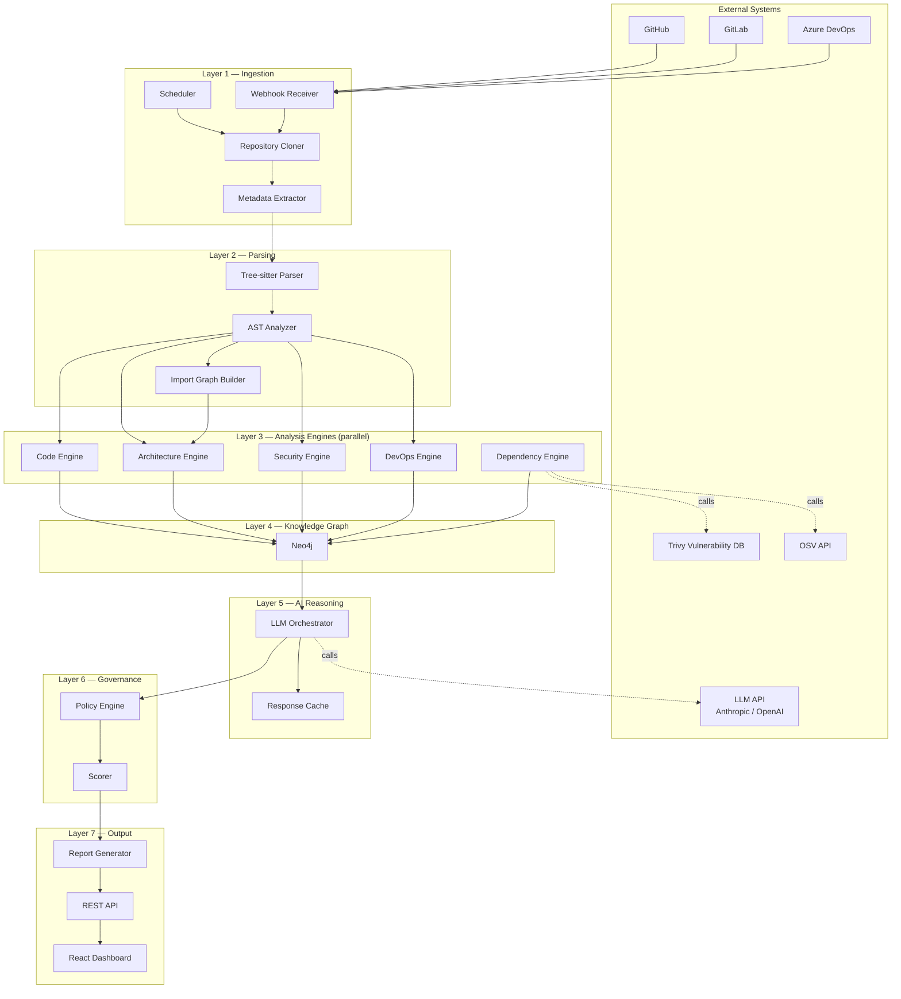
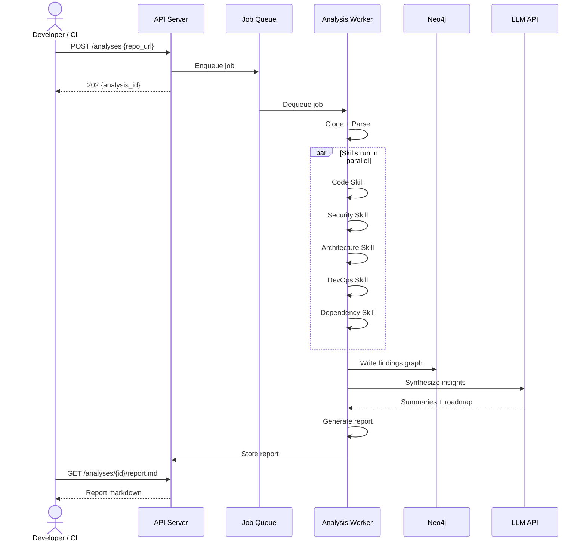

# High-Level Architecture

## System Overview

The AI Engineering Intelligence Platform is a multi-tier system composed of seven layers, each with a clear responsibility boundary. Data flows in one direction: from raw repositories at the bottom to human-readable reports at the top.

---

## Architecture Diagram

---

## Layer Responsibilities

| Layer | Components | Responsibility |
|-------|-----------|---------------|
| 1. Ingestion | Webhook Receiver, Scheduler, Cloner, Metadata Extractor | Accept repository references, clone to local disk, extract metadata |
| 2. Parsing | Tree-sitter Parser, AST Analyzer, Import Graph Builder | Generate language-agnostic structural representation |
| 3. Analysis | 5 parallel engines | Evaluate repository across all quality dimensions |
| 4. Knowledge Graph | Neo4j | Persist findings in queryable, persistent graph |
| 5. AI Reasoning | LLM Orchestrator, Cache | Synthesize findings into natural language insights |
| 6. Governance | Policy Engine, Scorer | Evaluate compliance against organizational standards |
| 7. Output | Report Generator, REST API, Dashboard | Deliver findings to users in usable formats |

---

## Key Design Decisions

### Decision 1: AI Augments Static Analysis (Not Replaces It)

Static analysis runs first and produces structured `Finding` objects with specific file and line references. The AI layer only receives these structured findings — it never reads raw source code. This means:
- AI output is grounded in verifiable facts
- No risk of the AI "inventing" findings
- Token costs are controlled (findings are much smaller than source code)
- The platform still works if the AI service is unavailable

### Decision 2: Skill-Based Extensibility

Every analysis dimension is a self-contained `Skill` module. Adding a new analysis type requires only:
1. Creating a new skill file (`skills/your-skill.md` or Python class)
2. Registering it in the skill runner

No changes to core infrastructure. This follows the Open/Closed Principle.

### Decision 3: Graph-First Knowledge Storage

All findings are stored as nodes/edges in Neo4j rather than flat JSON documents. This enables:
- Questions that span multiple dimensions: "show files with both secrets and no tests"
- Portfolio-level queries across repositories
- Temporal queries: "what changed between last week and this week?"
- Relationship traversal: "which repos use a vulnerable version of log4j?"

### Decision 4: Ephemeral Clones

Repository clones exist only for the duration of analysis. After Stage 7, the clone is deleted. This means:
- No persistent storage of customer code
- Disk usage is bounded by concurrent analyses
- Security: cloned code never persists in the system

### Decision 5: Fail-Safe Analysis

Each skill runs in isolation. If the DevOps skill times out, the Security, Code, and Architecture skills still complete and their findings are reported. The report notes which skills completed and which were skipped.

---

## Component Interaction Model

---

## Failure Domains

The architecture is designed so that failure in one domain does not cascade:

| Component fails | Impact | Mitigation |
|----------------|--------|-----------|
| LLM API | No AI summaries in report | Return raw findings without summaries |
| Neo4j | No trend data, no graph queries | Analysis still completes, results stored in PostgreSQL |
| Trivy/OSV | No CVE data | Dependency skill reports "scan unavailable" |
| Single worker | Queued jobs processed by other workers | HPA adds workers if queue depth grows |
| Redis queue | No new analyses triggered | API returns 503; existing analyses continue |

---

## Related Documents

- [Component Architecture](component-architecture.md)
- [Microservices Architecture](microservices-architecture.md)
- [Data Flow](data-flow.md)
- [System Design](../docs/system-design.md)
