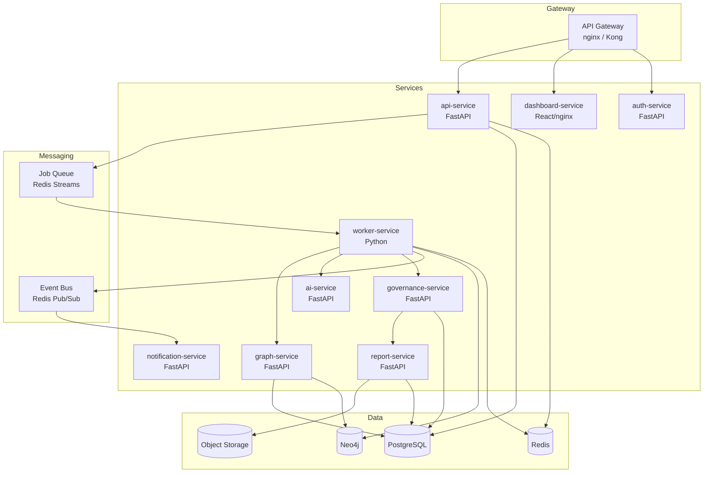

# Microservices Architecture

## Service Decomposition

The platform is decomposed into focused services that communicate asynchronously via a message queue and synchronously via REST/gRPC where needed.



---

## Service Specifications

### api-service

**Responsibility:** HTTP gateway for all client-facing requests

**Endpoints:**
- `POST /analyses` — trigger analysis
- `GET /analyses/{id}` — status and results
- `GET /portfolio/scores` — portfolio view
- `POST /webhooks/github` — GitHub webhook ingestion
- `POST /webhooks/gitlab` — GitLab webhook ingestion

**Scales:** Horizontally (stateless)
**Persistence:** PostgreSQL (analysis metadata)
**Communication:** Publishes to Redis job queue; reads from Redis cache

---

### worker-service

**Responsibility:** Core analysis execution engine

**Behavior:**
- Consumes jobs from Redis queue
- Clones repository (ephemeral, in `/tmp`)
- Runs all skills in parallel
- Calls graph-service, ai-service, governance-service
- Cleanup: deletes clone after completion

**Scales:** Horizontally (auto-scaled by queue depth)
**Persistence:** Writes to Neo4j via graph-service
**Communication:** Calls other services via internal REST

---

### graph-service

**Responsibility:** All Neo4j read/write operations

**Endpoints:**
- `POST /graph/runs` — write analysis run to graph
- `POST /graph/findings` — write findings in batch
- `GET /graph/runs/{id}/findings` — read findings
- `POST /graph/query` — execute Cypher query
- `GET /graph/trends/{repo_url}` — score history

**Scales:** Horizontally (reads) + Neo4j handles scaling
**Persistence:** Neo4j
**Why separate?** Isolates all graph operations, enables schema evolution without touching workers

---

### ai-service

**Responsibility:** LLM orchestration and response caching

**Endpoints:**
- `POST /synthesize` — synthesize findings into summaries
- `GET /cache/{hash}` — check synthesis cache

**Scales:** Horizontally; rate-limited by LLM API quotas
**Persistence:** Redis (cache), PostgreSQL (usage metering)
**Caching:** Redis TTL 24h, keyed by findings hash

---

### governance-service

**Responsibility:** Policy evaluation and compliance scoring

**Endpoints:**
- `POST /evaluate` — evaluate analysis against policy
- `GET /policies` — list available policies
- `POST /policies` — create custom policy
- `GET /portfolio/compliance` — portfolio compliance view

**Scales:** Horizontally (stateless; policies stored in DB)
**Persistence:** PostgreSQL (policies, evaluation history)

---

### report-service

**Responsibility:** Template rendering and report storage

**Endpoints:**
- `POST /reports` — generate report from analysis context
- `GET /reports/{id}.md` — Markdown report
- `GET /reports/{id}.html` — HTML report
- `GET /reports/{id}.json` — JSON report

**Scales:** Horizontally
**Persistence:** Object storage (S3/Azure Blob), PostgreSQL (metadata)

---

### auth-service

**Responsibility:** Authentication and authorization

**Endpoints:**
- `POST /auth/token` — issue JWT
- `POST /auth/validate` — validate JWT (called by API gateway)
- `POST /auth/api-keys` — create/revoke API keys
- `POST /auth/users` — user management (admin only)

**Scales:** Horizontally
**Persistence:** PostgreSQL

---

### notification-service

**Responsibility:** Outbound alerts (Slack, email, webhook callbacks)

**Triggers:**
- Analysis complete
- New critical finding
- Compliance status change
- Score drops below threshold

**Scales:** Horizontally (stateless; event-driven)
**Communication:** Subscribes to Redis Pub/Sub events

---

## Inter-Service Communication

### Synchronous (REST)
Used when the caller needs a response to continue:
- Worker → graph-service (write findings)
- Worker → ai-service (synthesize)
- API → auth-service (validate token)

### Asynchronous (Message Queue)
Used for long-running or fire-and-forget:
- api-service → job queue → worker-service (analysis trigger)
- worker-service → event bus → notification-service (alerts)

### Service Discovery
Services resolve each other by Kubernetes DNS:
```
http://graph-service.repo-intel.svc.cluster.local
http://ai-service.repo-intel.svc.cluster.local
```

---

## Deployment per Service

| Service | Replicas (prod) | Resources | Notes |
|---------|---------------|-----------|-------|
| api-service | 2–5 (HPA) | 256Mi/0.25 CPU | Behind load balancer |
| worker-service | 3–20 (HPA) | 2Gi/1 CPU | Auto-scale on queue depth |
| graph-service | 2–4 (HPA) | 512Mi/0.5 CPU | Read-heavy |
| ai-service | 2–4 (HPA) | 256Mi/0.25 CPU | Rate-limited by LLM API |
| governance-service | 2 | 256Mi/0.25 CPU | Low load |
| report-service | 2 | 256Mi/0.25 CPU | Low load |
| auth-service | 2 | 256Mi/0.25 CPU | Critical path |
| notification-service | 1–2 | 128Mi/0.1 CPU | Event-driven |
| dashboard-service | 2 | 128Mi/0.1 CPU | Static files via nginx |

---

## Service Communication Matrix

| Caller | Callee | Protocol | When |
|--------|--------|---------|------|
| api-service | auth-service | REST | Every authenticated request |
| api-service | job queue | Redis RPUSH | Analysis triggered |
| worker-service | graph-service | REST | Post-analysis |
| worker-service | ai-service | REST | Post-analysis |
| worker-service | governance-service | REST | Post-analysis |
| governance-service | report-service | REST | Post-evaluation |
| worker-service | notification-service | Redis Pub/Sub | Analysis events |
| dashboard | api-service | REST | User actions |

---

## Related Documents

- [High-Level Architecture](high-level-architecture.md)
- [Component Architecture](component-architecture.md)
- [Data Flow](data-flow.md)
- [Deployment Architecture](../docs/deployment-architecture.md)
