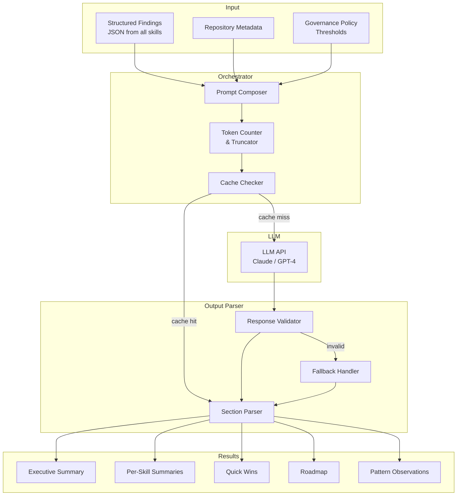

# AI Reasoning Engine

## Overview

The AI Reasoning Engine is the intelligence layer that transforms structured analysis findings into human-readable, prioritized insights. It uses a large language model (LLM) orchestrated via a structured prompt pipeline to produce executive summaries, cross-cutting observations, and actionable recommendations.

The engine is designed to *augment* static analysis, not replace it. Static tools are deterministic and fast. The AI layer adds:
- Natural language synthesis of complex findings
- Pattern recognition that crosses skill boundaries
- Contextual prioritization by business impact
- Actionable, specific recommendations with file references

---

## Architecture



---

## Prompt Design

The engine uses a structured, multi-section prompt template:

```
SYSTEM:
You are a Principal Software Architect conducting a code review.
Your job is to synthesize static analysis findings into actionable
engineering intelligence. Be specific — always reference file names
and line numbers. Be honest — if findings are severe, say so clearly.

USER:
## Repository
URL: {repo_url}
Primary Language: {language}
Total Files: {file_count}
Total Lines: {loc}

## Analysis Findings by Skill

### Code Quality (Score: {code_score}/10)
{code_findings_json}

### Architecture (Score: {arch_score}/10)
{arch_findings_json}

### Security (Score: {security_score}/10)
{security_findings_json}

### DevOps (Score: {devops_score}/10)
{devops_findings_json}

### Dependency Risk (Score: {dep_score}/10)
{dep_findings_json}

## Generate the following sections:

1. EXECUTIVE_SUMMARY
   3-4 sentences: what is this project, overall health, single most
   important action required.

2. SKILL_SUMMARIES
   One sentence per skill explaining the key finding in that dimension.

3. CROSS_CUTTING_PATTERNS
   2-3 observations about patterns that span multiple skills (e.g.
   "security issues correlate with untested files").

4. TOP_3_QUICK_WINS
   Three specific actions completable in under 1 hour. Each must include
   the exact file path and a concrete command or code change.

5. ROADMAP
   - THIS_WEEK: 3-5 critical actions
   - THIS_MONTH: 3-5 important improvements
   - THIS_QUARTER: 2-3 strategic investments

Respond in JSON format matching the schema below.
```

---

## Response Schema

```json
{
  "executive_summary": "string",
  "skill_summaries": {
    "code": "string",
    "architecture": "string",
    "security": "string",
    "devops": "string",
    "dependency": "string"
  },
  "cross_cutting_patterns": ["string", "string"],
  "top_quick_wins": [
    {
      "title": "string",
      "file": "string",
      "action": "string",
      "effort": "< 1 hour"
    }
  ],
  "roadmap": {
    "this_week": ["string"],
    "this_month": ["string"],
    "this_quarter": ["string"]
  }
}
```

---

## Token Budget Management

LLM APIs have context window limits. The engine manages tokens via:

1. **Finding truncation** — only the top 50 findings by severity are included
2. **Detail stripping** — for medium/low findings, only title and file path are sent
3. **Deduplication** — same-file, same-rule findings are collapsed to one
4. **Summary pre-compression** — long detail fields are summarized to 100 chars

```python
def build_prompt_context(findings: list[Finding], max_tokens: int = 6000) -> str:
    # Sort by severity
    sorted_findings = sorted(
        findings,
        key=lambda f: SEVERITY_ORDER[f.severity]
    )

    # Take top N
    critical_high = [f for f in sorted_findings if f.severity in ("critical", "high")]
    medium_low = [f for f in sorted_findings if f.severity in ("medium", "low")]

    # Include all critical/high, truncate medium/low
    included = critical_high + medium_low[:20]

    return json.dumps([f.to_prompt_dict() for f in included], indent=2)
```

---

## Caching Strategy

AI synthesis is deterministic given the same inputs. The engine caches responses by input hash:

```python
import hashlib

def compute_cache_key(findings: list[Finding], metadata: RepoMetadata) -> str:
    payload = json.dumps({
        "findings": [f.to_dict() for f in sorted(findings, key=lambda x: x.rule_id)],
        "metadata": metadata.to_dict()
    }, sort_keys=True)
    return hashlib.sha256(payload.encode()).hexdigest()
```

Cache TTL: 24 hours. Cache is invalidated on new analysis run.

---

## LLM Provider Abstraction

The engine supports multiple LLM providers via a common interface:

```python
class LLMProvider(Protocol):
    async def complete(
        self,
        system: str,
        user: str,
        max_tokens: int,
        response_format: Literal["json", "text"]
    ) -> str:
        ...

class AnthropicProvider:
    def __init__(self, api_key: str, model: str = "claude-sonnet-4-6"):
        self.client = anthropic.AsyncAnthropic(api_key=api_key)
        self.model = model

    async def complete(self, system, user, max_tokens, response_format) -> str:
        message = await self.client.messages.create(
            model=self.model,
            max_tokens=max_tokens,
            system=system,
            messages=[{"role": "user", "content": user}]
        )
        return message.content[0].text
```

---

## Fallback Behavior

If the LLM call fails or returns invalid JSON:

1. Retry once with a simplified prompt (remove cross-cutting patterns request)
2. If retry fails, fall back to template-based summary generation (no AI)
3. The report is still generated with raw findings — AI sections are marked as "unavailable"

This ensures the platform always produces a useful report even during LLM API outages.

---

## Quality Evaluation

AI output quality is monitored via:

| Metric | Method |
|--------|--------|
| Response validity | JSON schema validation on every response |
| Hallucination detection | File paths in AI output are validated against actual repo |
| Relevance score | Cosine similarity between AI summary and raw findings |
| User feedback | Report thumbs up/down captured in dashboard |

---

## Recommended Models

| Provider | Model | Notes |
|----------|-------|-------|
| Anthropic | `claude-sonnet-4-6` | Best balance of accuracy and speed |
| Anthropic | `claude-opus-4-6` | Higher accuracy for complex repos |
| OpenAI | `gpt-4o` | Good alternative, slightly different output style |
| Azure OpenAI | `gpt-4o` | Preferred for enterprises requiring data residency |

---

## Integration with Semantic Kernel / LangChain

For teams preferring an orchestration framework:

**Semantic Kernel (C#/.NET)**
```csharp
var kernel = Kernel.CreateBuilder()
    .AddAzureOpenAIChatCompletion(deploymentName, endpoint, apiKey)
    .Build();

var analysisPlugin = kernel.ImportPluginFromType<AnalysisPlugin>();
var result = await kernel.InvokeAsync(
    analysisPlugin["SynthesizeFindings"],
    new KernelArguments { ["findings"] = findingsJson }
);
```

**LangChain (Python)**
```python
from langchain.chains import LLMChain
from langchain.prompts import PromptTemplate

chain = LLMChain(
    llm=ChatAnthropic(model="claude-sonnet-4-6"),
    prompt=PromptTemplate.from_template(SYNTHESIS_PROMPT)
)
result = chain.invoke({"findings": findings_json, "repo_url": repo_url})
```

---

## Related Documents

- [Analysis Engines](analysis-engines.md)
- [System Design](system-design.md)
- [Data Pipeline](data-pipeline.md)
- [Code Analyzer Agent](../agents/code-analyzer-agent.md)
