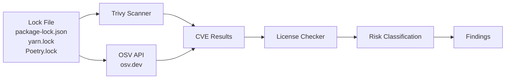

# Analysis Engines

## Overview

Analysis Engines are the core processing units of the platform. Each engine is a self-contained skill module that analyzes one dimension of a repository and emits structured findings.

All engines share the same interface:
- **Input:** `RepoContext` (parsed repository)
- **Output:** `SkillResult` (findings + metrics + score)
- **Behavior:** Stateless, parallelizable, timeout-isolated

---

## Engine Registry

| Engine | Skill File | Score Weight | Primary Tools |
|--------|-----------|-------------|---------------|
| Code Quality | `skills/code.md` | 25% | AST metrics, custom rules |
| Architecture | `skills/architecture.md` | 20% | Dependency graph analysis |
| Security | `skills/security.md` | 30% | Semgrep, regex patterns |
| DevOps | `skills/devops.md` | 15% | File pattern matching |
| Dependency Risk | `skills/dependency.md` | 10% | Trivy, OSV API |
| Governance | `skills/governance.md` | Composite | Policy ruleset |

---

## 1. Code Quality Engine

**What it measures:**
- Language and file distribution
- Test coverage estimation (test file ratio)
- Code complexity (file length, function length, nesting depth)
- Duplication signals (near-identical blocks)
- Documentation coverage (README, inline comments, docstrings)

**Scoring model:**

| Criterion | Score Contribution |
|-----------|-------------------|
| Test ratio ≥ 30% | +2 |
| No files > 500 lines | +1.5 |
| No deeply nested code (4+ levels) | +1.5 |
| TODO/FIXME count < 20 | +1 |
| Substantive README exists | +1 |
| No silent exception swallowing | +1.5 |
| Docs folder or inline docstrings | +1.5 |
| **Maximum** | **10** |

**Detection commands used:**
```bash
# File and language counts
find . -type f | grep -v node_modules | grep -v .git \
  | sed 's/.*\.//' | sort | uniq -c | sort -rn | head -20

# Long files (>500 lines)
find . -type f -name "*.py" -o -name "*.ts" -o -name "*.cs" \
  | xargs wc -l 2>/dev/null | awk '$1 > 500' | sort -rn

# Test files
find . -type f | grep -E "(test|spec|__tests__|_test\.)" | wc -l
```

---

## 2. Architecture Engine

**What it measures:**
- Project type detection (framework/runtime identification)
- Directory structure quality (layered vs flat)
- Dependency count and version pinning
- Circular dependency detection
- Design pattern presence (DI, Repository, Factory, Event-driven)
- God object detection (single files/classes with excessive responsibility)

**Project type detection heuristics:**

```python
PROJECT_TYPE_SIGNALS = {
    "React":        ["package.json", "react"],
    "Next.js":      ["next.config.js", "next.config.ts"],
    "Django":       ["manage.py", "django"],
    "FastAPI":      ["main.py", "fastapi"],
    "Spring Boot":  ["pom.xml", "spring-boot"],
    "ASP.NET Core": [".csproj", "Microsoft.AspNetCore"],
    "Go API":       ["go.mod", "net/http"],
    "Rails":        ["Gemfile", "rails"],
}
```

**Circular dependency detection (JS/TS):**
```bash
# Build import graph and detect cycles
npx madge --circular src/
```

---

## 3. Security Engine

**What it measures:**

### Secrets Detection
Patterns scanned across all files:

| Pattern | What it catches |
|---------|----------------|
| `AKIA[0-9A-Z]{16}` | AWS Access Key IDs |
| `BEGIN.*PRIVATE KEY` | RSA/EC private keys |
| `ghp_[a-zA-Z0-9]{36}` | GitHub Personal Access Tokens |
| `password\s*=\s*['"]\S{8,}` | Hardcoded passwords |
| `sk_live_[a-zA-Z0-9]+` | Stripe live API keys |
| `mongodb\+srv://` | MongoDB Atlas connection strings |
| `postgresql://.*:.*@` | PostgreSQL connection strings with creds |

### Vulnerable Code Patterns (Semgrep rules)
- SQL injection via string concatenation
- `eval()` with user input
- `innerHTML` / `dangerouslySetInnerHTML` without sanitization
- `subprocess` / `exec` with shell=True
- `pickle.loads()` on untrusted data
- MD5/SHA1 for password hashing
- Non-cryptographic RNG for security purposes (`Math.random`, `System.Random`)

### Configuration Issues
- Debug mode enabled in production config
- CORS `*` wildcard
- HTTP instead of HTTPS in base URLs
- Missing security headers

**Risk level mapping:**

| Condition | Risk Level |
|-----------|-----------|
| Any secrets/credentials found | 🔴 Critical |
| Injection patterns + no gitignore | 🟠 High |
| Insecure patterns, no secret exposure | 🟡 Medium |
| Minor hygiene issues only | 🟢 Low |

---

## 4. DevOps Engine

**What it measures:**

### CI/CD Pipeline
Detected platforms and checks performed:

| Platform | Config Location | Checks |
|----------|----------------|--------|
| GitHub Actions | `.github/workflows/*.yml` | Test step, lint step, security scan, outdated actions |
| GitLab CI | `.gitlab-ci.yml` | Same checks |
| Azure Pipelines | `azure-pipelines.yml` | Same checks |
| Jenkins | `Jenkinsfile` | Presence only |
| CircleCI | `.circleci/config.yml` | Presence only |

### Dockerfile Best Practices
```
✅ Multi-stage build
✅ Non-root USER instruction
✅ .dockerignore exists
✅ Specific base image tag (not :latest)
✅ COPY instead of ADD for local files
✅ --no-install-recommends for apt-get
❌ Secrets in ENV or ARG
❌ npm install without --ci
```

### Repo Hygiene Checklist
```
✅ README.md (>20 lines)
✅ LICENSE
✅ CHANGELOG.md
✅ CONTRIBUTING.md
✅ .editorconfig
✅ Lock file present
✅ SECURITY.md
✅ Dependabot config
```

---

## 5. Dependency Risk Engine

**What it measures:**
- Known CVEs via Trivy and OSV API
- License risk classification
- Package staleness (last release date)
- Dependency count and bloat detection
- Transitive dependency depth

**Integration workflow:**



**License risk levels:**

| Risk | Licenses | Implication |
|------|----------|-------------|
| 🟢 Permissive | MIT, Apache-2.0, BSD | Safe for commercial use |
| 🟡 Copyleft-weak | LGPL, MPL | Review before use in proprietary code |
| 🔴 Copyleft-strong | GPL, AGPL | May require source disclosure |
| 🔴 Unknown | No license | Legally "all rights reserved" |

**Trivy integration:**
```bash
# Scan repository for CVEs in dependencies
trivy fs --security-checks vuln,secret,config \
  --format json \
  --output trivy-results.json \
  /path/to/repo
```

---

## 6. Governance Engine

The Governance Engine is a composite engine that scores the repository against a configured policy ruleset. It runs after all other engines complete.

**Policy evaluation:**

```python
@dataclass
class PolicyRule:
    name: str
    description: str
    expression: str   # e.g. "security.score >= 6"
    blocking: bool    # if True, marks the run as non-compliant
    severity: str     # critical / high / medium / low

class GovernanceEngine:
    def evaluate(self, skill_results: dict[str, SkillResult]) -> GovernanceResult:
        metrics = self._flatten_metrics(skill_results)
        passed = []
        failed = []

        for rule in self.policy_rules:
            if eval_expression(rule.expression, metrics):
                passed.append(rule)
            else:
                failed.append(rule)

        return GovernanceResult(
            passed=passed,
            failed=failed,
            is_compliant=not any(r.blocking for r in failed),
            governance_score=len(passed) / len(self.policy_rules) * 10
        )
```

**Default policy ruleset:**

| Rule | Expression | Blocking |
|------|-----------|---------|
| No committed secrets | `security.critical_count == 0` | Yes |
| Minimum security score | `security.score >= 5` | Yes |
| CI/CD required | `devops.has_ci == true` | No |
| Minimum test coverage | `code.test_ratio >= 0.1` | No |
| No extremely long files | `code.max_file_lines <= 2000` | No |
| No critical CVEs | `dependency.critical_cve_count == 0` | Yes |

---

## Adding a Custom Engine

1. Create `skills/your-skill.md` following the template in `skills/HOW-TO-ADD-SKILL.md`
2. Register the skill in `ANALYZE.md` Step 2
3. (Optional) For the programmatic platform: implement `Skill` protocol in Python
4. Update the governance policy if the new skill should affect compliance scoring

---

## Related Documents

- [Repository Ingestion](repository-ingestion.md)
- [Security Analysis](security-analysis.md)
- [DevOps Analysis](devops-analysis.md)
- [Governance Model](governance-model.md)
- [Plugin/Skill Framework](../engineering/plugin-skill-framework.md)
