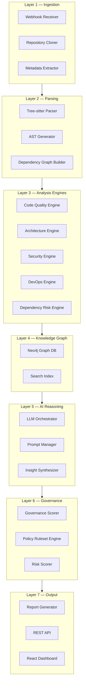
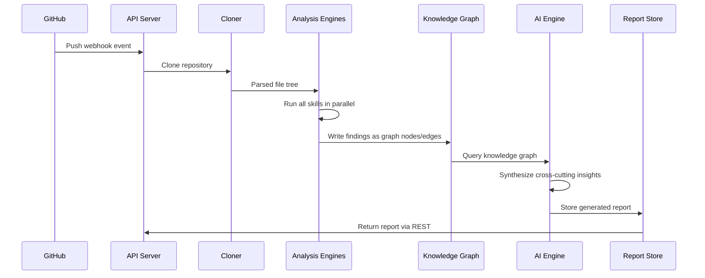
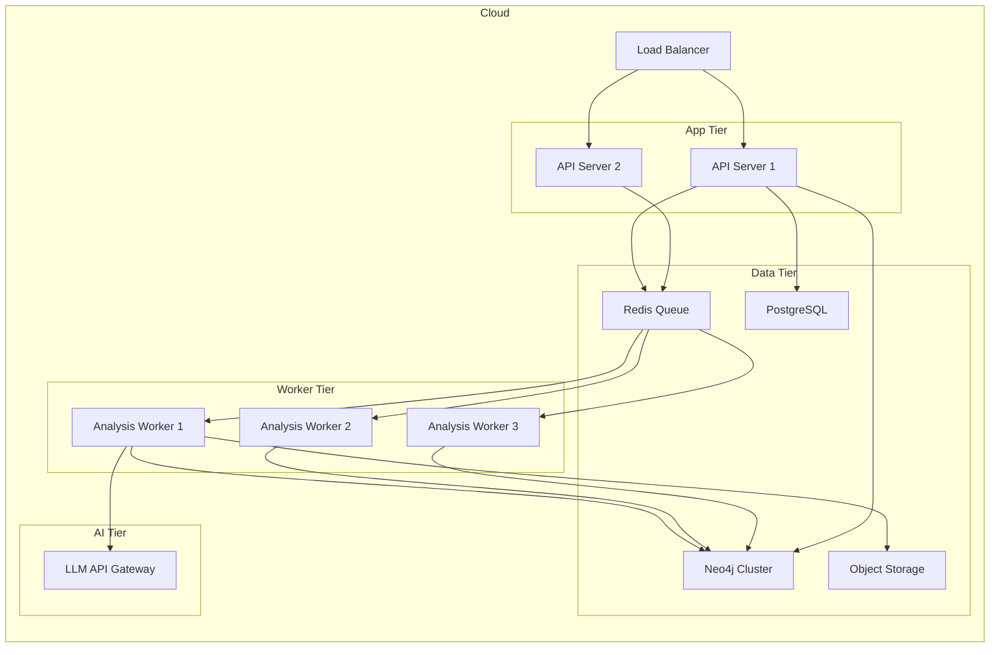

# System Architecture

## Architectural Principles

The platform is designed around five core principles:

1. **Skill-based extensibility** — Analysis capabilities are modular skills that can be added without modifying the core engine
2. **Graph-first knowledge** — All relationships are stored in a knowledge graph, enabling cross-cutting queries
3. **AI-augmented, not AI-dependent** — Static analysis runs first; AI adds synthesis and natural language reasoning on top
4. **Fail-safe analysis** — Each skill runs independently; one failure does not block others
5. **Immutable reports** — Generated reports are versioned snapshots, not live views

---

## Layered Architecture

---

## Component Overview

### Ingestion Layer

| Component | Responsibility | Technology |
|-----------|---------------|------------|
| Webhook Receiver | Receives push/PR events from GitHub/GitLab | FastAPI endpoint |
| Repository Cloner | Shallow-clones repositories to local disk | `gitpython`, `subprocess` |
| Metadata Extractor | Extracts language breakdown, file counts, commit stats | `pygments`, `gitpython` |

### Parsing Layer

| Component | Responsibility | Technology |
|-----------|---------------|------------|
| Tree-sitter Parser | Generates ASTs for 40+ languages | `tree-sitter` |
| AST Generator | Extracts functions, classes, imports, exports | Custom tree-sitter grammars |
| Dependency Graph Builder | Maps import/require/using relationships | AST traversal |

### Analysis Engines

| Engine | What it analyzes | Tools |
|--------|-----------------|-------|
| Code Quality Engine | Complexity, test coverage, duplication | Custom metrics + AST |
| Architecture Engine | Structure, patterns, coupling | Dependency graph traversal |
| Security Engine | Secrets, vulnerabilities, insecure patterns | Semgrep, custom regex |
| DevOps Engine | CI/CD, Docker, IaC, hygiene | File pattern matching |
| Dependency Risk Engine | CVEs, license risk, supply chain | Trivy, OSV API |

### Knowledge Graph Layer

All analysis outputs are written as nodes and edges into a Neo4j graph. This enables:
- Cross-cutting queries (e.g. "find all files that have both security issues and no tests")
- Relationship traversal (e.g. "which services depend on this vulnerable library?")
- Trend analysis across analysis runs

### AI Reasoning Layer

The LLM orchestrator takes the structured knowledge graph output and:
1. Generates natural language summaries per skill dimension
2. Identifies patterns that span multiple dimensions
3. Prioritizes findings by impact
4. Produces executive-level insights

### Governance Layer

Scores each repository against a configurable policy ruleset:
- Architecture compliance (naming conventions, layer boundaries, dependency direction)
- Security posture (minimum score thresholds, mandatory checks)
- Code health (coverage thresholds, complexity limits)
- DevOps maturity (required pipeline stages, hygiene requirements)

---

## Data Flow

---

## Deployment Topology

---

## Technology Decisions

### Why tree-sitter for parsing?
Tree-sitter provides concrete syntax trees (not just tokens) for 40+ languages with a single consistent API. Error recovery means malformed code still produces a partial AST. It's significantly faster than language-specific tools.

### Why Neo4j for the knowledge graph?
The relationships between files, functions, dependencies, and findings are naturally graph-shaped. Neo4j's Cypher query language makes cross-cutting queries (e.g. "find all high-severity findings in files with no tests") simple to express.

### Why a message queue for analysis?
Repository analysis can take 30 seconds to 5 minutes depending on codebase size. A message queue (Redis/RabbitMQ) decouples ingestion from analysis, enables parallel workers, and provides retry/dead-letter semantics.

### Why separate AI and static analysis?
Static analysis is deterministic, fast, and cheap. AI reasoning is probabilistic, slower, and costs money per call. Running static analysis first and feeding structured results to the AI dramatically reduces token costs and improves accuracy.

---

## Security Architecture

- All repository clones are performed in isolated ephemeral containers
- Cloned code never touches the API tier — only analysis results do
- Secrets found during analysis are hashed before storage — never stored in plaintext
- All API endpoints require authentication (JWT)
- Knowledge graph access is tenant-isolated

---

## Related Documents

- [Component Architecture](../architecture/component-architecture.md)
- [Microservices Architecture](../architecture/microservices-architecture.md)
- [Data Flow](../architecture/data-flow.md)
- [Deployment Architecture](deployment-architecture.md)
