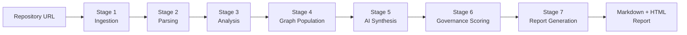

# Data Pipeline

## Pipeline Overview

The data pipeline transforms a raw repository URL into a structured intelligence report in a series of deterministic stages. Each stage produces outputs consumed by the next.



---

## Stage 1 — Ingestion

**Input:** Repository URL (GitHub, GitLab, Azure DevOps, Bitbucket)

**Process:**
1. Validate URL format and reachability
2. Extract host, org, repo name, and optional branch
3. Authenticate using configured access tokens
4. Shallow-clone: `git clone --depth 1 --single-branch <url> <tmpdir>`
5. Extract repository metadata from git log and file tree

**Output:** `RepoContext` object containing:
- Local clone path
- Language distribution (via file extension analysis)
- File tree (path, size, extension, last modified)
- Commit metadata (latest commit SHA, author, date)

**Tools:** `gitpython`, `pygments` (language detection)

**Error conditions:**
- Repository not found or access denied → abort with user-facing error
- Clone fails (network timeout) → retry once with exponential backoff; then abort

---

## Stage 2 — Parsing

**Input:** Local clone path

**Process:**
1. Walk the file tree, excluding: `.git/`, `node_modules/`, `vendor/`, `dist/`, `build/`, `.cache/`
2. For each supported language file, run tree-sitter parser to produce AST
3. Extract structural elements:
   - Functions (name, line range, parameters, return type)
   - Classes (name, methods, inheritance)
   - Imports / requires / using statements
   - Exports / public interfaces
4. Build import graph: which files import which other files
5. Detect framework/library signatures (React, Django, Spring, etc.)

**Output:**
- `ParsedRepo` — list of `ParsedFile` objects with AST summaries
- `ImportGraph` — directed graph of file dependencies

**Tools:** `tree-sitter`, language-specific grammars

**Performance notes:**
- Files over 10,000 lines are parsed in streaming mode to limit memory usage
- Binary files, images, and data files are skipped
- Parsing runs in a separate process pool to avoid GIL contention

---

## Stage 3 — Analysis (Parallel)

**Input:** `ParsedRepo` + `ImportGraph` + raw file access

**Process:** All skills run in parallel via `asyncio.gather()`:

```
┌─────────────────────────────────────────────────────┐
│                 Skill Runner                         │
│                                                     │
│  ┌──────────┐  ┌──────────┐  ┌──────────┐          │
│  │  Code    │  │ Security │  │  Arch    │ ...       │
│  │  Skill   │  │  Skill   │  │  Skill   │          │
│  └────┬─────┘  └────┬─────┘  └────┬─────┘          │
│       │              │              │                │
│       └──────────────┴──────────────┘                │
│                      │                               │
│               Merged Findings                        │
└─────────────────────────────────────────────────────┘
```

Each skill produces:
- A list of `Finding` objects (severity, category, file, line, fix)
- A metrics dict (numeric measurements)
- A dimension score (0–10)

---

## Stage 4 — Knowledge Graph Population

**Input:** Merged skill results + ParsedRepo

**Process:**
1. Create/update `Repository` node
2. Create `AnalysisRun` node linked to repository
3. Upsert `File` nodes (one per source file)
4. Create `Finding` nodes linked to analysis run and file
5. Create `Dependency` nodes from import graph
6. Create edges: `FILE -[:IMPORTS]-> FILE`, `FILE -[:HAS_FINDING]-> FINDING`

**Output:** Neo4j graph populated with this analysis run's data

**Cypher example:**
```cypher
MERGE (r:Repository {url: $repo_url})
CREATE (run:AnalysisRun {id: $run_id, started_at: $ts})
CREATE (r)-[:HAS_RUN]->(run)

UNWIND $findings AS f
CREATE (finding:Finding {
  id: f.id,
  severity: f.severity,
  category: f.category,
  title: f.title,
  file_path: f.file_path,
  line_number: f.line_number
})
CREATE (run)-[:PRODUCED]->(finding)
```

---

## Stage 5 — AI Synthesis

**Input:** Structured findings JSON + repository metadata

**Process:**
1. Build structured prompt with findings grouped by skill
2. Call LLM API (Claude / GPT-4) with findings as context
3. Parse structured response:
   - Per-skill summary sentence
   - Cross-skill observations
   - Executive summary
   - Top 3 quick wins
   - Recommended roadmap

**Prompt design:**
```
You are a senior software architect reviewing an analysis report.

Repository: {repo_url}
Primary language: {language}

Analysis findings:
{findings_json}

Generate:
1. Executive summary (3-4 sentences)
2. Per-skill summary (one sentence each)
3. Top 3 quick wins (specific, actionable, with file references)
4. Roadmap (this week / this month / this quarter)
```

**Cost optimization:**
- Findings are summarized before being sent to the AI (truncate low-severity details)
- Only the top 50 findings by severity are included in the AI prompt
- Caching: identical finding sets (by hash) reuse the previous AI response

---

## Stage 6 — Governance Scoring

**Input:** Skill results + configured policy ruleset

**Process:**
1. Evaluate each policy rule against skill metrics
2. Assign pass/fail per rule
3. Calculate dimension scores (weighted average)
4. Derive overall governance score
5. Flag any blocking policy violations

**Scoring model:**
```
Overall Score = weighted_average([
  code_score × 0.25,
  architecture_score × 0.20,
  security_score × 0.30,
  devops_score × 0.15,
  dependency_score × 0.10
])
```

Security is weighted highest (0.30) because credential exposure and critical vulnerabilities can have immediate, severe consequences regardless of other dimensions.

---

## Stage 7 — Report Generation

**Input:** All previous stage outputs

**Process:**
1. Load report template (markdown or HTML)
2. Populate all template sections with real data
3. Sort findings by severity (critical → high → medium → low)
4. Generate findings summary table
5. Write output files

**Output formats:**
- `report.md` — Markdown report (GitHub-renderable)
- `report.html` — Self-contained HTML (no external dependencies)
- `report.json` — Machine-readable structured data (for API consumers)

---

## Pipeline Timing (Typical)

| Stage | 10K LOC Repo | 100K LOC Repo |
|-------|-------------|--------------|
| Stage 1 — Ingestion | 5s | 20s |
| Stage 2 — Parsing | 3s | 15s |
| Stage 3 — Analysis (parallel) | 10s | 40s |
| Stage 4 — Graph population | 2s | 5s |
| Stage 5 — AI synthesis | 8s | 12s |
| Stage 6 — Governance scoring | <1s | <1s |
| Stage 7 — Report generation | 1s | 2s |
| **Total** | **~30s** | **~95s** |

---

## Retry & Idempotency

- Each stage is idempotent: rerunning with the same inputs produces the same outputs
- Failed analyses can be retried from any stage using the stored intermediate state
- The `AnalysisRun` node in Neo4j tracks stage completion status

---

## Related Documents

- [Repository Ingestion](repository-ingestion.md)
- [Analysis Engines](analysis-engines.md)
- [Knowledge Graph](knowledge-graph.md)
- [AI Reasoning Engine](ai-reasoning-engine.md)
