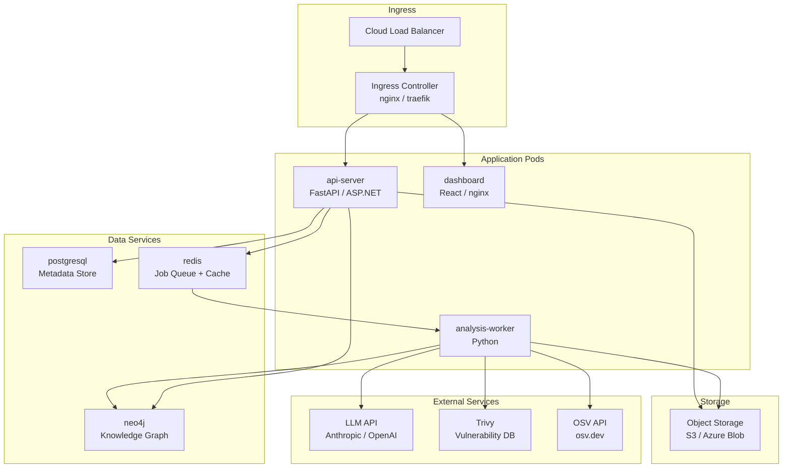

# Deployment Architecture

## Deployment Overview

The platform is designed for cloud-native deployment using containers and Kubernetes. It supports deployment on AWS, Azure, and GCP, as well as self-hosted Kubernetes clusters.

---

## Container Architecture



---

## Kubernetes Manifests

### API Server Deployment

```yaml
apiVersion: apps/v1
kind: Deployment
metadata:
  name: api-server
  namespace: repo-intel
spec:
  replicas: 2
  selector:
    matchLabels:
      app: api-server
  template:
    metadata:
      labels:
        app: api-server
    spec:
      containers:
        - name: api-server
          image: repo-intel/api-server:v1.2.0
          ports:
            - containerPort: 8000
          env:
            - name: DATABASE_URL
              valueFrom:
                secretKeyRef:
                  name: repo-intel-secrets
                  key: database-url
            - name: REDIS_URL
              valueFrom:
                secretKeyRef:
                  name: repo-intel-secrets
                  key: redis-url
            - name: NEO4J_URI
              valueFrom:
                secretKeyRef:
                  name: repo-intel-secrets
                  key: neo4j-uri
            - name: ANTHROPIC_API_KEY
              valueFrom:
                secretKeyRef:
                  name: repo-intel-secrets
                  key: anthropic-api-key
          resources:
            requests:
              memory: "256Mi"
              cpu: "250m"
            limits:
              memory: "512Mi"
              cpu: "500m"
          livenessProbe:
            httpGet:
              path: /health
              port: 8000
            initialDelaySeconds: 10
            periodSeconds: 30
          readinessProbe:
            httpGet:
              path: /ready
              port: 8000
            initialDelaySeconds: 5
            periodSeconds: 10
```

### Analysis Worker Deployment

```yaml
apiVersion: apps/v1
kind: Deployment
metadata:
  name: analysis-worker
  namespace: repo-intel
spec:
  replicas: 3    # base replicas; HPA scales this
  selector:
    matchLabels:
      app: analysis-worker
  template:
    metadata:
      labels:
        app: analysis-worker
    spec:
      containers:
        - name: worker
          image: repo-intel/analysis-worker:v1.2.0
          env:
            - name: REDIS_URL
              valueFrom:
                secretKeyRef:
                  name: repo-intel-secrets
                  key: redis-url
            - name: NEO4J_URI
              valueFrom:
                secretKeyRef:
                  name: repo-intel-secrets
                  key: neo4j-uri
            - name: ANTHROPIC_API_KEY
              valueFrom:
                secretKeyRef:
                  name: repo-intel-secrets
                  key: anthropic-api-key
            - name: TRIVY_DB_PATH
              value: /trivy-db
          volumeMounts:
            - name: tmp-storage
              mountPath: /tmp
            - name: trivy-db
              mountPath: /trivy-db
          resources:
            requests:
              memory: "1Gi"
              cpu: "500m"
            limits:
              memory: "4Gi"
              cpu: "2000m"
      volumes:
        - name: tmp-storage
          emptyDir:
            sizeLimit: 10Gi
        - name: trivy-db
          persistentVolumeClaim:
            claimName: trivy-db-pvc
      securityContext:
        runAsNonRoot: true
        runAsUser: 1000
```

---

## Infrastructure as Code (Terraform)

### AWS EKS Module

```hcl
module "eks" {
  source  = "terraform-aws-modules/eks/aws"
  version = "~> 20.0"

  cluster_name    = "repo-intel-prod"
  cluster_version = "1.29"

  vpc_id     = module.vpc.vpc_id
  subnet_ids = module.vpc.private_subnets

  eks_managed_node_groups = {
    api = {
      instance_types = ["t3.medium"]
      min_size       = 2
      max_size       = 5
      desired_size   = 2
    }
    workers = {
      instance_types = ["m5.xlarge"]
      min_size       = 2
      max_size       = 20
      desired_size   = 3
      taints = [{
        key    = "workload"
        value  = "analysis"
        effect = "NO_SCHEDULE"
      }]
    }
  }
}

module "neo4j" {
  source = "./modules/neo4j-enterprise"
  instance_type = "r5.2xlarge"
  storage_gb    = 500
  replica_count = 2
}
```

---

## Environment Topology

### Production

| Component | Size | Count | Notes |
|-----------|------|-------|-------|
| API Server | t3.medium | 2+ (HPA) | Stateless |
| Analysis Worker | m5.xlarge | 3–20 (HPA) | Stateful temp disk |
| Neo4j | r5.2xlarge | 3 (cluster) | 500GB SSD |
| PostgreSQL | db.t3.large | 1 primary + 1 replica | RDS |
| Redis | cache.t3.medium | 1 primary + 1 replica | ElastiCache |

### Staging

Mirrors production at 25% scale. Uses the same container images.

### Development

Docker Compose for local development:

```yaml
# docker-compose.yml
version: "3.9"
services:
  api:
    build: ./api
    ports: ["8000:8000"]
    environment:
      DATABASE_URL: postgresql://${DB_USER}:${DB_PASSWORD}@db:5432/repointel  # Override via environment variables in production
      REDIS_URL: redis://redis:6379
      NEO4J_URI: bolt://neo4j:7687
    depends_on: [db, redis, neo4j]

  worker:
    build: ./worker
    environment:
      REDIS_URL: redis://redis:6379
      NEO4J_URI: bolt://neo4j:7687
    depends_on: [redis, neo4j]

  db:
    image: postgres:16-alpine
    environment:
      POSTGRES_DB: repointel
      POSTGRES_PASSWORD: postgres
    volumes: [postgres_data:/var/lib/postgresql/data]

  redis:
    image: redis:7-alpine

  neo4j:
    image: neo4j:5.18-enterprise
    environment:
      NEO4J_AUTH: neo4j/password
      NEO4J_ACCEPT_LICENSE_AGREEMENT: "yes"
    ports: ["7474:7474", "7687:7687"]

  dashboard:
    build: ./dashboard
    ports: ["3000:3000"]

volumes:
  postgres_data:
```

---

## Secrets Management

All secrets are stored in a secrets manager — never in environment variables directly on the host or in source control:

| Platform | Secrets Manager |
|----------|----------------|
| AWS | AWS Secrets Manager + External Secrets Operator |
| Azure | Azure Key Vault + Azure Key Vault Provider for Secrets Store CSI |
| GCP | Google Secret Manager + Workload Identity |
| Self-hosted | HashiCorp Vault |

```yaml
# External Secrets Operator (AWS)
apiVersion: external-secrets.io/v1beta1
kind: ExternalSecret
metadata:
  name: repo-intel-secrets
spec:
  refreshInterval: 5m
  secretStoreRef:
    name: aws-secrets-manager
    kind: ClusterSecretStore
  target:
    name: repo-intel-secrets
  data:
    - secretKey: anthropic-api-key
      remoteRef:
        key: repo-intel/prod/anthropic-api-key
    - secretKey: database-url
      remoteRef:
        key: repo-intel/prod/database-url
```

---

## Observability Stack

| Tool | Purpose |
|------|---------|
| Prometheus | Metrics collection |
| Grafana | Metrics dashboards |
| OpenTelemetry | Distributed tracing |
| Loki | Log aggregation |
| PagerDuty / OpsGenie | Alert routing |

**Key metrics to monitor:**

```yaml
# Custom metrics emitted by the platform
analysis_queue_depth          # job queue backlog
analysis_duration_seconds     # per-run analysis time (histogram)
analysis_success_total        # successful completions counter
analysis_failure_total        # failure counter (by error type)
skill_execution_duration_ms   # per-skill timing (histogram)
llm_api_latency_ms            # AI synthesis latency
neo4j_write_duration_ms       # graph population timing
cache_hit_ratio               # AI synthesis cache efficiency
```

---

## CI/CD Pipeline for the Platform Itself

```yaml
# .github/workflows/deploy.yml
name: Deploy

on:
  push:
    branches: [main]

jobs:
  test:
    runs-on: ubuntu-latest
    steps:
      - uses: actions/checkout@v4
      - run: pip install -r requirements-dev.txt
      - run: pytest tests/ -v --cov

  build:
    needs: test
    runs-on: ubuntu-latest
    steps:
      - uses: actions/checkout@v4
      - name: Build and push Docker images
        run: |
          docker build -t $ECR_REGISTRY/api-server:$SHA ./api
          docker build -t $ECR_REGISTRY/worker:$SHA ./worker
          docker push $ECR_REGISTRY/api-server:$SHA
          docker push $ECR_REGISTRY/worker:$SHA

  deploy-staging:
    needs: build
    runs-on: ubuntu-latest
    environment: staging
    steps:
      - name: Deploy to staging
        run: |
          helm upgrade --install repo-intel ./helm \
            --namespace repo-intel-staging \
            --set image.tag=$SHA \
            --values helm/values-staging.yaml

  deploy-prod:
    needs: deploy-staging
    runs-on: ubuntu-latest
    environment: production
    steps:
      - name: Deploy to production
        run: |
          helm upgrade --install repo-intel ./helm \
            --namespace repo-intel-prod \
            --set image.tag=$SHA \
            --values helm/values-prod.yaml
```

---

## Related Documents

- [Scalability](scalability.md)
- [Architecture](architecture.md)
- [System Design](system-design.md)
