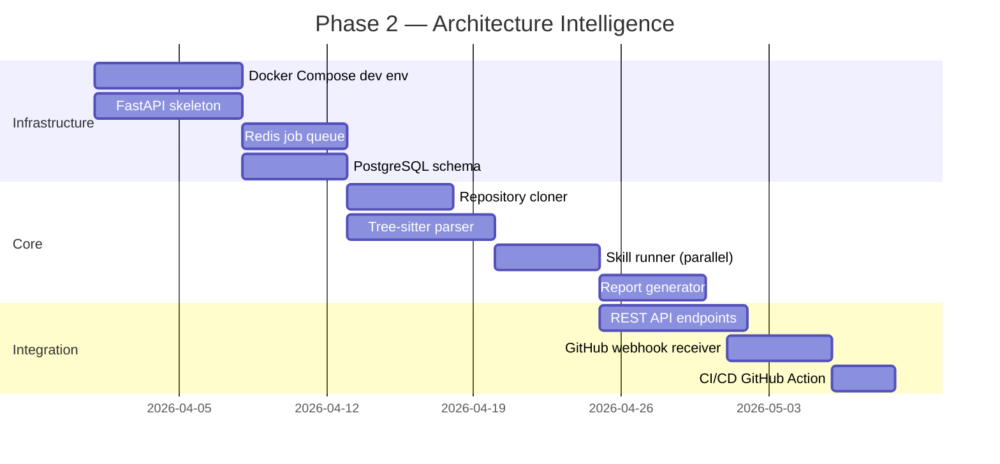

# Development Roadmap

## Phased Implementation Plan

The platform is built in 5 phases, each delivering usable value. Phases are sequential but designed so each can ship independently.

---

## Phase 1 — MVP: Prompt-Based Analysis

**Duration:** Weeks 1–4
**Status:** ✅ Complete (current state of this repository)

### Goal
Deliver a working analysis tool using Claude Code as the intelligence layer, with no backend infrastructure required.

### Deliverables

| Component | Description | Status |
|-----------|-------------|--------|
| `ANALYZE.md` | Orchestration prompt with parallel agent execution | ✅ Done |
| `skills/code.md` | Code quality skill (multi-language, error patterns) | ✅ Done |
| `skills/architecture.md` | Architecture skill (SOLID, multi-project, diagrams) | ✅ Done |
| `skills/security.md` | Security skill (OWASP Top 10, .NET/Java/Go patterns) | ✅ Done |
| `skills/devops.md` | DevOps skill (GitHub Actions, Azure DevOps, GitLab CI) | ✅ Done |
| `skills/dependency.md` | Dependency/supply chain skill (NuGet, Maven, npm, pip) | ✅ Done |
| `skills/governance.md` | Governance scoring skill (19 policies, RPI) | ✅ Done |
| `skills/claude-metrics.md` | Claude run metrics tracking | ✅ Done |
| `output/report-template.md` | Markdown report template | ✅ Done |
| `output/report-template.html` | HTML report template (dark/light mode, diagrams) | ✅ Done |
| `examples/` | Sample report | ✅ Done |
| `CLAUDE.md` | Claude Code guidance file | ✅ Done |

### Phase 1 Gaps (inputs to Phase 2)
- Manual process — no automation (but uses Claude subagents for parallel skill execution)
- No persistent storage of analysis history
- No multi-repo portfolio view
- No webhook integration
- Limited to repos accessible from Claude Code's environment
- No programmatic skill execution (prompt-based only)

---

## Phase 2 — Architecture Intelligence

**Duration:** Weeks 5–10
**Target: Automated Analysis API**

### Goal
Build the backend service that automates repository analysis, removing the manual Claude Code workflow. Engineers can trigger analyses via API or CI/CD.

### Deliverables

### Key Milestones
- [ ] `POST /analyses` — trigger analysis via API
- [ ] `GET /analyses/{id}` — poll for completion
- [ ] `GET /analyses/{id}/report.md` — retrieve report
- [ ] GitHub webhook: auto-analyze on every push to `main`
- [ ] Docker Compose local development environment

### Tech Stack Decisions
- **API Framework:** FastAPI (Python) — async, OpenAPI built-in, fast iteration
- **Parser:** tree-sitter with Python bindings
- **Queue:** Redis with `rq` (Redis Queue) for simplicity
- **Database:** PostgreSQL (run metadata, users, API keys)

---

## Phase 3 — Knowledge Graph

**Duration:** Weeks 11–16
**Target: Persistent Intelligence Layer**

### Goal
Store all analysis results in a Neo4j knowledge graph, enabling historical trend tracking, cross-repository queries, and relationship traversal.

### Deliverables

| Component | Description |
|-----------|-------------|
| Neo4j schema | Constraints, indexes, node/edge types |
| Graph writer | Post-analysis graph population |
| Graph query API | `POST /graph/query` Cypher endpoint |
| Score trending | Time-series views per repository |
| Portfolio view | Multi-repo dashboard data |
| Dependency graph | Import relationships mapped in graph |

### Schema Design (see [knowledge-graph.md](knowledge-graph.md))

### Key Milestones
- [ ] Neo4j cluster deployed (dev + prod)
- [ ] Every analysis writes findings to graph
- [ ] `GET /portfolio/scores` returns multi-repo health
- [ ] Score trend endpoint returns 30-day history
- [ ] Cypher query API live

---

## Phase 4 — AI Reasoning Engine

**Duration:** Weeks 17–22
**Target: Intelligent Synthesis**

### Goal
Replace the current Claude Code manual synthesis with a programmatic AI reasoning pipeline that runs as part of every automated analysis.

### Deliverables

| Component | Description |
|-----------|-------------|
| LLM orchestrator | Anthropic/OpenAI abstraction layer |
| Prompt manager | Templated prompts with token budget management |
| Response parser | JSON schema validation of AI outputs |
| Cache layer | Skip AI call when findings unchanged |
| Fallback handler | Template-based summaries if LLM unavailable |
| Cross-skill patterns | AI identifies findings that span dimensions |

### Key Milestones
- [ ] AI synthesis runs automatically post-analysis
- [ ] Executive summary in every report
- [ ] Cross-cutting pattern detection live
- [ ] AI response cache achieving >70% hit rate
- [ ] Support for both Anthropic and OpenAI providers

### AI Evaluation Metrics
- Response validity rate > 99% (valid JSON)
- File path accuracy > 95% (no hallucinated paths)
- User satisfaction > 4/5 stars (report feedback)

---

## Phase 5 — Governance Platform

**Duration:** Weeks 23–30
**Target: Enterprise Engineering Governance**

### Goal
Build the governance scoring layer, policy engine, and executive dashboard that transforms analysis data into organizational engineering compliance tracking.

### Deliverables

| Component | Description |
|-----------|-------------|
| Policy engine | YAML-defined policy rulesets with pass/fail evaluation |
| Compliance API | `POST /governance/evaluate` — per-repo compliance check |
| CI/CD gate | GitHub Action that fails PR if blocking policies fail |
| React dashboard | Portfolio health matrix, score trends, finding drilldown |
| Executive reports | PDF/email summaries for engineering leadership |
| RBAC | Role-based access: engineer, team lead, admin, executive |
| Notifications | Slack/email alerts on compliance failures or score drops |

### Dashboard Screens

1. **Portfolio Overview** — all repos, scores, compliance status
2. **Repository Detail** — findings by skill, trend chart, roadmap
3. **Security Dashboard** — all critical/high security findings across portfolio
4. **Dependency Risk** — CVE exposure, license risk heatmap
5. **Trend Analysis** — score changes over time, improvement tracking

### Key Milestones
- [ ] Policy engine evaluates all repos against configurable ruleset
- [ ] CI/CD gate blocks non-compliant PRs
- [ ] React dashboard deployed with portfolio view
- [ ] Slack integration sends alerts on new critical findings
- [ ] Executive PDF report generation

---

## Backlog (Post-Phase 5)

These features are planned but not yet scheduled:

| Feature | Description | Priority |
|---------|-------------|---------|
| PR-level analysis | Analyze only changed files in a PR, with inline GitHub comments | High |
| Multi-language deep parsing | Language-specific analyzers (C#, Java, Go, Rust) beyond tree-sitter | High |
| Performance skill | N+1 queries, missing indexes, bundle size, memory leaks, async anti-patterns | High |
| API design skill | REST conventions, versioning, error response consistency, OpenAPI validation | Medium |
| Database skill | Migration files, ORM usage, raw SQL, connection pooling, index coverage | Medium |
| Architecture diff | Compare architecture between two commits or branches | Medium |
| Custom rule authoring | UI for writing and testing custom governance rules | Medium |
| SBOM generation | Software Bill of Materials export (SPDX/CycloneDX) | Medium |
| Accessibility skill | Missing alt tags, ARIA roles, color contrast in HTML/JSX/Razor | Medium |
| Logging/observability skill | Structured logging, sensitive data in logs, missing error logging, tracing | Medium |
| IDE plugin | VS Code extension for real-time analysis | Low |
| SonarQube integration | Import SonarQube findings into unified governance view | Low |
| Self-hosted runner | On-premise deployment for air-gapped environments | High (enterprise) |
| Multi-repo comparison | Side-by-side comparison of two or more repos with delta analysis | Medium |
| Historical trend analysis | Track score changes over multiple analysis runs | High |

---

## Current State vs. Requirements Gap

| Requirement | Current State | Phase to address |
|-------------|--------------|-----------------|
| Repository ingestion from GitHub/GitLab | Manual clone via ANALYZE.md Step 1 | Phase 2 (API-driven) |
| Code parsing and indexing | Claude code reading + bash commands | Phase 2 (tree-sitter AST) |
| Architecture discovery | `skills/architecture.md` — SOLID, multi-project, diagrams | Phase 2 (automated) |
| Static code analysis | `skills/code.md` — multi-language, error patterns | Phase 2 (automated) |
| Security vulnerability analysis | `skills/security.md` — OWASP Top 10, multi-language | Phase 2 + Semgrep |
| Dependency and supply chain analysis | `skills/dependency.md` — NuGet, Maven, npm, pip, Go, Rust | Phase 2 (automated) |
| CI/CD and infrastructure analysis | `skills/devops.md` — GitHub Actions, Azure DevOps, GitLab CI | Phase 2 (automated) |
| Governance scoring and reporting | `skills/governance.md` — 19 policies, RPI, compliance | Phase 5 (policy engine UI) |
| Code knowledge graph generation | **Not started** | Phase 3 |
| AI reasoning over codebase | Claude Code with parallel subagents | Phase 4 (programmatic LLM) |
| Automated architecture documentation | Mermaid diagrams in report template | Phase 4 (enhanced) |
| Multi-project/solution analysis | ANALYZE.md Step 1.5 discovery scan | Phase 2 (automated) |
| Design principles assessment | `skills/architecture.md` — SOLID, DRY, KISS | Phase 2 (automated scoring) |

---

## Success Metrics

| Phase | Success Metric |
|-------|---------------|
| Phase 1 | Analysis report generated for 3+ real repositories |
| Phase 2 | API analysis completes in < 3 minutes for a 100K LOC repo |
| Phase 3 | Knowledge graph query returns cross-repo findings in < 500ms |
| Phase 4 | AI summaries achieve > 4/5 user satisfaction rating |
| Phase 5 | Portfolio dashboard used weekly by 3+ engineering leaders |

---

## Related Documents

- [Overview](overview.md)
- [Architecture](architecture.md)
- [Governance Model](governance-model.md)
- [API Design](api-design.md)
