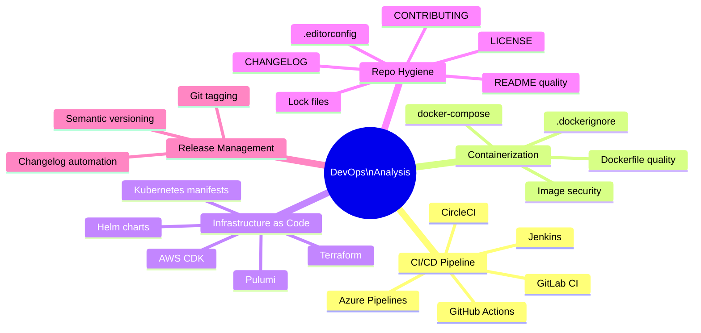

# DevOps Analysis

## Overview

The DevOps Analysis engine evaluates a repository's operational maturity: CI/CD pipeline quality, containerization practices, infrastructure as code presence, and repository hygiene. A well-functioning DevOps setup is the foundation that enables all other quality practices to be enforced consistently.

---

## Analysis Dimensions



---

## CI/CD Pipeline Analysis

### Detection

```bash
# GitHub Actions
ls .github/workflows/

# GitLab CI
cat .gitlab-ci.yml | head -30

# Azure Pipelines
ls azure-pipelines.yml

# Jenkins
ls Jenkinsfile

# CircleCI
ls .circleci/config.yml

# Buildkite
ls .buildkite/pipeline.yml
```

### GitHub Actions Deep Inspection

For each workflow file, the engine checks:

| Check | Pass Condition | Severity if failed |
|-------|---------------|-------------------|
| Has test step | `test`, `jest`, `pytest`, `go test`, `dotnet test` present | High |
| Has lint step | `lint`, `eslint`, `flake8`, `golint` present | Medium |
| Has build step | `build`, `compile`, `make` present | High |
| Has security scan | `codeql`, `snyk`, `trivy`, `semgrep` present | High |
| No hardcoded secrets | Only `${{ secrets.NAME }}` references | Critical |
| Uses recent actions | `@v3` or `@v4`, not `@v1` or `@v2` | Low |
| Runs on PRs | Triggered on `pull_request` | Medium |
| Has branch protection | Runs on `main`/`master` too | Low |

### Ideal GitHub Actions Workflow

```yaml
name: CI

on:
  push:
    branches: [main]
  pull_request:
    branches: [main]

jobs:
  build-and-test:
    runs-on: ubuntu-latest
    steps:
      - uses: actions/checkout@v4

      - name: Set up language runtime
        uses: actions/setup-node@v4  # or setup-python, setup-go, etc.
        with:
          node-version: '20'

      - name: Install dependencies
        run: npm ci

      - name: Lint
        run: npm run lint

      - name: Test
        run: npm test

      - name: Build
        run: npm run build

  security:
    runs-on: ubuntu-latest
    steps:
      - uses: actions/checkout@v4

      - name: Run Trivy vulnerability scanner
        uses: aquasecurity/trivy-action@master
        with:
          scan-type: 'fs'
          scan-ref: '.'
          severity: 'CRITICAL,HIGH'

      - name: Run Semgrep
        uses: returntocorp/semgrep-action@v1
        with:
          config: p/security-audit
```

---

## Dockerfile Analysis

### Best Practices Checklist

```python
DOCKERFILE_CHECKS = [
    Check(
        name="No :latest tag",
        pattern=r"FROM .+:latest",
        severity="medium",
        fix="Pin to a specific version: FROM node:20-alpine"
    ),
    Check(
        name="Non-root user",
        pattern=r"USER ",
        must_exist=True,
        severity="medium",
        fix="Add: USER node (or appropriate non-root user)"
    ),
    Check(
        name="Multi-stage build",
        pattern=r"FROM .+ AS ",
        must_exist=True,
        severity="low",
        fix="Use multi-stage builds to reduce final image size"
    ),
    Check(
        name="No ADD for local files",
        pattern=r"^ADD (?!http)",
        severity="low",
        fix="Replace ADD with COPY for local files"
    ),
    Check(
        name="No secrets in ENV/ARG",
        pattern=r"(ENV|ARG) .*(SECRET|PASSWORD|KEY|TOKEN)",
        severity="critical",
        fix="Use Docker secrets or runtime environment variables"
    ),
    Check(
        name=".dockerignore exists",
        file=".dockerignore",
        must_exist=True,
        severity="low",
        fix="Add .dockerignore to exclude node_modules, .git, etc."
    ),
]
```

### Ideal Dockerfile Pattern (Node.js example)

```dockerfile
# Stage 1: Build
FROM node:20-alpine AS builder
WORKDIR /app
COPY package*.json ./
RUN npm ci --only=production

# Stage 2: Production image
FROM node:20-alpine AS production
WORKDIR /app

# Non-root user
RUN addgroup -g 1001 -S nodejs && \
    adduser -S nextjs -u 1001

COPY --from=builder --chown=nextjs:nodejs /app/node_modules ./node_modules
COPY --chown=nextjs:nodejs . .

USER nextjs
EXPOSE 3000
CMD ["node", "server.js"]
```

---

## Infrastructure as Code Detection

| Tool | Detection Signal | Analysis |
|------|-----------------|---------|
| Terraform | `*.tf` files | Module structure, variable references, backend config |
| Pulumi | `Pulumi.yaml` | Stack definitions |
| AWS CDK | `cdk.json` | App structure |
| Kubernetes | `*.yaml` with `apiVersion:` | Resource types, namespace usage, resource limits |
| Helm | `charts/` or `Chart.yaml` | Chart structure, values.yaml presence |
| Ansible | `ansible.cfg`, `playbook.yml` | Playbook structure |

**Kubernetes checks:**
```bash
# Find all K8s manifests
find . -name "*.yaml" -o -name "*.yml" \
  | xargs grep -l "apiVersion:" 2>/dev/null

# Check for resource limits (important for production)
grep -r "resources:" k8s/ && grep -r "limits:" k8s/

# Check for liveness/readiness probes
grep -r "livenessProbe\|readinessProbe" k8s/
```

---

## Repository Hygiene Scoring

| File | Points | Check |
|------|--------|-------|
| `README.md` (>20 lines) | 2 | Useful, not placeholder |
| `LICENSE` | 1 | Clear licensing |
| `CHANGELOG.md` | 1 | Release history tracked |
| `CONTRIBUTING.md` | 0.5 | Onboarding guide present |
| `.editorconfig` | 0.5 | Consistent formatting |
| Lock file (`package-lock.json`, `poetry.lock`, etc.) | 2 | Reproducible installs |
| `SECURITY.md` | 1 | Vulnerability disclosure process |
| Dependabot config | 1 | Automated dependency updates |
| CI badge in README | 0.5 | Build status visible |
| **Maximum** | **9.5 → normalized to 10** | |

### README Quality Check

A README is considered substantive if it contains:
- Project description (what it does)
- Installation or setup instructions
- Usage example or quick start
- At least one code block

---

## DevOps Score Calculation

```python
def calculate_devops_score(metrics: DevOpsMetrics) -> int:
    score = 0

    # CI/CD (up to 4 points)
    if metrics.has_ci:
        score += 2
    if metrics.ci_has_tests:
        score += 1
    if metrics.ci_has_security_scan:
        score += 1

    # Containerization (up to 2 points)
    if metrics.has_dockerfile:
        score += 1
        if metrics.dockerfile_best_practices_score >= 70:
            score += 1

    # IaC (up to 1 point)
    if metrics.has_iac:
        score += 1

    # Hygiene (up to 3 points)
    score += metrics.hygiene_score / 10 * 3

    return min(10, round(score))
```

---

## Common DevOps Findings by Severity

### Critical
- Hardcoded secrets in CI/CD workflow files
- Production secrets in Dockerfile ENV instructions

### High
- No CI/CD pipeline at all
- CI pipeline has no test step
- Outdated GitHub Actions versions (security risk)

### Medium
- No Docker support (for server-side applications)
- Missing README or placeholder README
- No lock file (non-reproducible installs)
- `FROM image:latest` in Dockerfile

### Low
- Missing CHANGELOG
- Missing CONTRIBUTING.md
- No CI badge in README
- `.editorconfig` not configured
- No semantic versioning setup

---

## Related Documents

- [Analysis Engines](analysis-engines.md)
- [Repository Ingestion](repository-ingestion.md)
- [Deployment Architecture](deployment-architecture.md)
- [Governance Model](governance-model.md)
