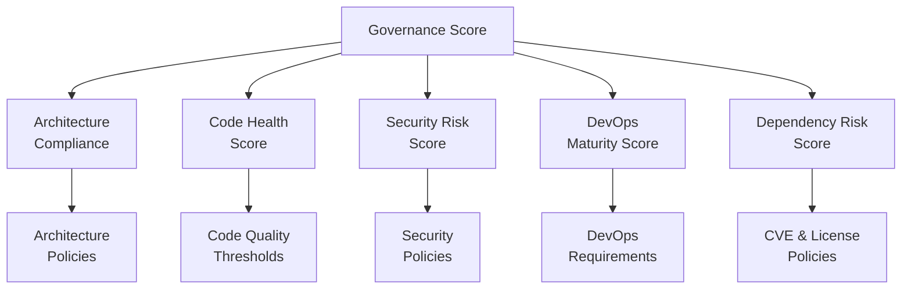
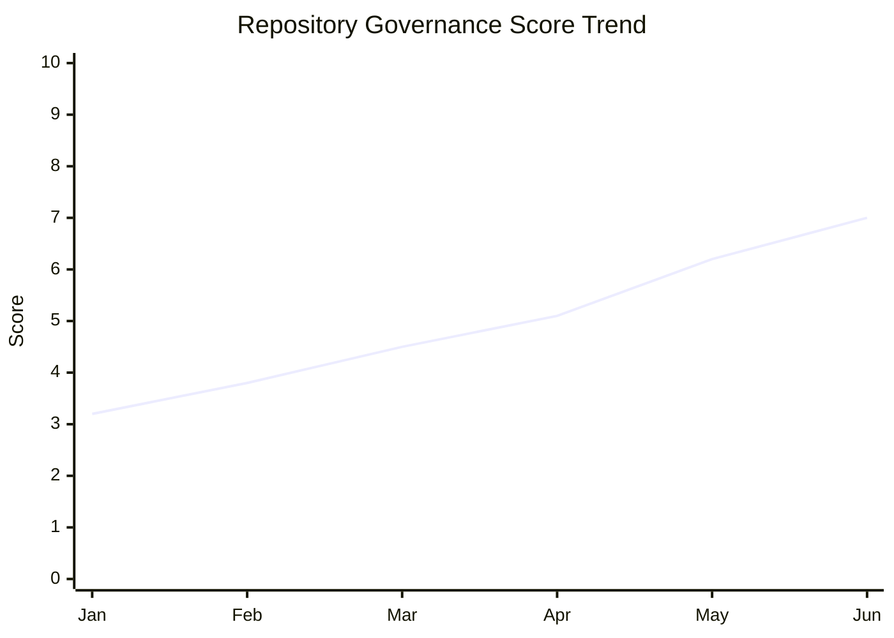

# Engineering Governance Model

## Overview

The Governance Model defines how the platform evaluates repositories against organizational engineering standards and produces a compliance assessment. It transforms raw analysis scores into a structured risk posture that engineering leadership can act on.

Governance answers three questions:
1. **Is this repository compliant** with our minimum engineering standards?
2. **What is the risk posture** of this codebase right now?
3. **How is the portfolio trending** over time?

---

## Governance Dimensions



---

## Policy Framework

### Policy Structure

```yaml
# governance/policies.yaml

policies:
  - id: SEC-001
    name: "No committed secrets or credentials"
    description: "No API keys, passwords, or private keys committed to source control"
    dimension: security
    rule: "security.critical_findings_by_category.secrets == 0"
    blocking: true         # fails compliance if violated
    severity: critical

  - id: SEC-002
    name: "Minimum security score"
    description: "Security dimension score must be at least 5/10"
    dimension: security
    rule: "security.score >= 5"
    blocking: true
    severity: high

  - id: DEP-001
    name: "No critical CVEs in dependencies"
    description: "No dependencies with CVSS score >= 9.0"
    dimension: dependency
    rule: "dependency.critical_cve_count == 0"
    blocking: true
    severity: critical

  - id: DEP-002
    name: "No high CVEs without mitigation"
    description: "Dependencies with CVSS 7.0-8.9 must have a documented exception"
    dimension: dependency
    rule: "dependency.high_cve_count <= 3"
    blocking: false
    severity: high

  - id: CODE-001
    name: "Minimum test coverage"
    description: "Test file ratio must be at least 10%"
    dimension: code
    rule: "code.test_ratio >= 0.10"
    blocking: false
    severity: high

  - id: CODE-002
    name: "No extremely large files"
    description: "No source files exceeding 3000 lines"
    dimension: code
    rule: "code.max_file_lines <= 3000"
    blocking: false
    severity: medium

  - id: DEVOPS-001
    name: "CI/CD pipeline required"
    description: "Repository must have a functional CI/CD pipeline"
    dimension: devops
    rule: "devops.has_ci == true"
    blocking: false
    severity: high

  - id: DEVOPS-002
    name: "Tests must run in CI"
    description: "CI pipeline must include a test execution step"
    dimension: devops
    rule: "devops.ci_has_tests == true"
    blocking: false
    severity: high

  - id: ARCH-001
    name: "Lock file required"
    description: "A dependency lock file must be committed"
    dimension: architecture
    rule: "architecture.has_lock_file == true"
    blocking: false
    severity: medium
```

---

## Compliance Assessment

### Compliance States

| State | Condition | Meaning |
|-------|-----------|---------|
| ✅ **Compliant** | No blocking policies failed | Repository meets minimum standards |
| ⚠️ **Conditionally Compliant** | No blocking failures; advisory failures present | Meets minimum bar; improvements recommended |
| ❌ **Non-Compliant** | One or more blocking policies failed | Cannot be promoted to production |

### Compliance Report Format

```
Repository Governance Assessment
─────────────────────────────────
Repository:  https://github.com/org/repo
Analyzed:    2026-03-12
Status:      ❌ NON-COMPLIANT

Blocking Violations:
  ❌ SEC-001  No committed secrets       CRITICAL  → Revoke credentials immediately
  ❌ DEP-001  No critical CVEs           CRITICAL  → Upgrade log4j to 2.17.1+

Advisory Violations:
  ⚠️  CODE-001  Minimum test coverage    HIGH      → Add tests (currently 3%)
  ⚠️  DEVOPS-001  CI/CD required         HIGH      → Add GitHub Actions workflow
  ⚠️  CODE-002  No extremely large files MEDIUM    → Split Context.cs (5766 lines)

Passed Policies:
  ✅ SEC-002  Minimum security score
  ✅ ARCH-001  Lock file required

Governance Score:  2/7 policies passed (29%)
Overall Risk:      🔴 CRITICAL
```

---

## Scoring Model

### Dimension Scores

Each skill produces a score 0–10. The governance engine derives a weighted overall score:

```
Overall Score = (
  security_score   × 0.30 +
  code_score       × 0.25 +
  architecture_score × 0.20 +
  devops_score     × 0.15 +
  dependency_score × 0.10
)
```

Security carries the highest weight (30%) because a single critical credential exposure can have immediate, severe, and irreversible consequences regardless of other quality metrics.

### Risk Posture Index

The Risk Posture Index (RPI) is a 0–100 score derived from weighted findings:

```python
def calculate_rpi(findings: list[Finding]) -> int:
    weights = {"critical": 25, "high": 10, "medium": 3, "low": 1}
    raw_score = sum(weights[f.severity] for f in findings)

    # Map to 0-100 inverted scale (100 = no risk, 0 = maximum risk)
    # Cap at 200 raw points (arbitrary ceiling)
    rpi = max(0, 100 - (raw_score / 200 * 100))
    return round(rpi)
```

| RPI | Risk Level | Color |
|-----|-----------|-------|
| 80–100 | Low Risk | 🟢 |
| 60–79 | Medium Risk | 🟡 |
| 40–59 | High Risk | 🟠 |
| 0–39 | Critical Risk | 🔴 |

---

## Architecture Compliance

Architecture governance checks whether the codebase follows declared structural standards:

### Layer Violation Detection
```python
# Define allowed dependency directions
LAYER_RULES = {
    "controllers": ["services", "models"],
    "services":    ["repositories", "models", "utils"],
    "repositories":["models", "utils"],
    "models":      ["utils"],
    "utils":       [],
}

# Flag if a lower layer imports a higher layer
def check_layer_violations(import_graph: ImportGraph) -> list[Finding]:
    violations = []
    for importer, imported in import_graph.edges():
        importer_layer = detect_layer(importer)
        imported_layer = detect_layer(imported)
        if imported_layer not in LAYER_RULES.get(importer_layer, []):
            violations.append(Finding(
                severity="medium",
                category="architecture",
                title=f"Layer violation: {importer_layer} → {imported_layer}",
                file_path=importer,
                fix=f"Move {imported} to a layer above {importer_layer}"
            ))
    return violations
```

---

## Portfolio Governance Dashboard

For organizations managing multiple repositories, the governance model supports portfolio-level views:

### Portfolio Health Matrix

```
Portfolio Health Report — Q1 2026
───────────────────────────────────────────────────────────
Repository              Score  Security  Code  DevOps  Status
───────────────────────────────────────────────────────────
payment-service          8.2     9/10    8/10   7/10   ✅
user-service             7.1     8/10    6/10   7/10   ✅
inventory-api            5.4     7/10    5/10   4/10   ⚠️
legacy-portal            2.1     1/10    3/10   2/10   ❌
mobile-backend           6.8     7/10    7/10   6/10   ✅
───────────────────────────────────────────────────────────
Portfolio Average        5.9     6.4     5.8   5.2     2/5 Compliant
```

---

## Governance Trend Tracking



Trend data is stored in the knowledge graph and queryable:

```cypher
MATCH (repo:Repository {url: $url})-[:HAS_RUN]->(run:AnalysisRun)
RETURN run.started_at, run.overall_score, run.security_score
ORDER BY run.started_at ASC
```

---

## Integration with CI/CD

The governance engine can be integrated as a CI/CD quality gate:

```yaml
# .github/workflows/governance-check.yml
- name: Run repo-intel governance check
  uses: your-org/repo-intel-action@v1
  with:
    repo_url: ${{ github.repository }}
    fail_on_non_compliant: true
    policy_file: .governance/policies.yaml
```

If blocking policies fail, the CI pipeline fails and the PR is blocked from merging.

---

## Related Documents

- [Analysis Engines](analysis-engines.md)
- [Security Analysis](security-analysis.md)
- [Governance Agent](../agents/governance-agent.md)
- [Development Roadmap](development-roadmap.md)
