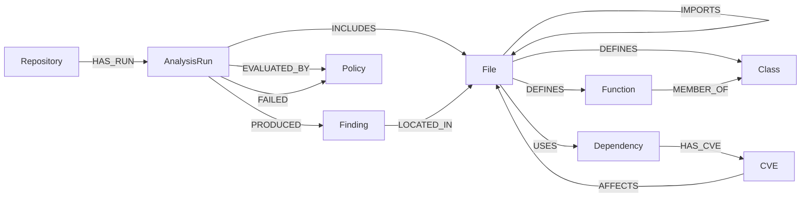

# Code Knowledge Graph

## Overview

The Knowledge Graph is the persistent, queryable representation of everything the platform learns about a repository. It is stored in Neo4j and updated on every analysis run.

The graph enables:
- Cross-cutting queries that span multiple analysis dimensions
- Historical trend tracking across analysis runs
- Relationship traversal (e.g. "which services import this vulnerable module?")
- Portfolio-level views across multiple repositories

---

## Graph Schema

### Node Types

| Label | Description | Key Properties |
|-------|-------------|---------------|
| `Repository` | A source code repository | `url`, `name`, `primary_language` |
| `AnalysisRun` | One execution of the analysis pipeline | `id`, `started_at`, `overall_score` |
| `File` | A source code file | `path`, `language`, `lines`, `complexity` |
| `Function` | A function or method | `name`, `file_path`, `line_start`, `line_end` |
| `Class` | A class or interface | `name`, `file_path` |
| `Finding` | An analysis finding | `severity`, `category`, `title`, `rule_id` |
| `Dependency` | An external package dependency | `name`, `version`, `ecosystem`, `license` |
| `CVE` | A known vulnerability | `cve_id`, `cvss_score`, `description` |
| `Policy` | A governance policy rule | `name`, `rule_expression`, `blocking` |

### Edge Types

| Edge | From | To | Description |
|------|------|----|-------------|
| `HAS_RUN` | Repository | AnalysisRun | Repository has been analyzed |
| `INCLUDES` | AnalysisRun | File | This run analyzed this file |
| `PRODUCED` | AnalysisRun | Finding | This run produced this finding |
| `LOCATED_IN` | Finding | File | Finding is in this file |
| `IMPORTS` | File | File | File imports another file |
| `DEFINES` | File | Function | File defines this function |
| `DEFINES` | File | Class | File defines this class |
| `MEMBER_OF` | Function | Class | Function is a method of this class |
| `USES` | File | Dependency | File uses this dependency |
| `HAS_CVE` | Dependency | CVE | Dependency has this vulnerability |
| `AFFECTS` | CVE | File | Vulnerability affects files using this dep |
| `EVALUATED_BY` | AnalysisRun | Policy | Run was evaluated against policy |
| `PASSED` | AnalysisRun | Policy | Run passed this policy |
| `FAILED` | AnalysisRun | Policy | Run failed this policy |

---

## Schema Diagram



---

## Neo4j Schema Design

### Constraints

```cypher
-- Ensure uniqueness
CREATE CONSTRAINT repo_url IF NOT EXISTS
  FOR (r:Repository) REQUIRE r.url IS UNIQUE;

CREATE CONSTRAINT run_id IF NOT EXISTS
  FOR (r:AnalysisRun) REQUIRE r.id IS UNIQUE;

CREATE CONSTRAINT finding_id IF NOT EXISTS
  FOR (f:Finding) REQUIRE f.id IS UNIQUE;

CREATE CONSTRAINT dep_name_version IF NOT EXISTS
  FOR (d:Dependency) REQUIRE (d.name, d.version, d.ecosystem) IS NODE KEY;

CREATE CONSTRAINT cve_id IF NOT EXISTS
  FOR (c:CVE) REQUIRE c.cve_id IS UNIQUE;
```

### Indexes

```cypher
-- Fast lookups for common query patterns
CREATE INDEX file_path IF NOT EXISTS FOR (f:File) ON (f.path);
CREATE INDEX finding_severity IF NOT EXISTS FOR (f:Finding) ON (f.severity);
CREATE INDEX finding_rule_id IF NOT EXISTS FOR (f:Finding) ON (f.rule_id);
CREATE INDEX dep_name IF NOT EXISTS FOR (d:Dependency) ON (d.name);
CREATE INDEX run_started_at IF NOT EXISTS FOR (r:AnalysisRun) ON (r.started_at);
```

---

## Example Queries

### Find all critical security findings in the latest analysis run

```cypher
MATCH (repo:Repository {url: $repo_url})
      -[:HAS_RUN]->(run:AnalysisRun)
      -[:PRODUCED]->(finding:Finding {severity: "critical"})
      -[:LOCATED_IN]->(file:File)
WHERE finding.category IN ["secrets", "injection", "config"]
RETURN finding.title, finding.file_path, finding.line_number, finding.fix
ORDER BY finding.category
```

### Find files with no tests that also have high-severity findings

```cypher
MATCH (run:AnalysisRun)-[:PRODUCED]->(f:Finding)-[:LOCATED_IN]->(file:File)
WHERE f.severity IN ["critical", "high"]
  AND NOT (file)-[:COVERED_BY]->(:TestFile)
RETURN file.path, count(f) AS finding_count, collect(f.title) AS findings
ORDER BY finding_count DESC
```

### Find all dependencies with known CVEs

```cypher
MATCH (dep:Dependency)-[:HAS_CVE]->(cve:CVE)
WHERE cve.cvss_score >= 7.0
RETURN dep.name, dep.version, cve.cve_id, cve.cvss_score, cve.description
ORDER BY cve.cvss_score DESC
```

### Trace which files are affected by a vulnerable dependency

```cypher
MATCH (file:File)-[:USES]->(dep:Dependency {name: $dep_name})-[:HAS_CVE]->(cve:CVE)
RETURN file.path, dep.version, cve.cve_id, cve.cvss_score
ORDER BY cve.cvss_score DESC
```

### Get score trend for a repository over last 10 runs

```cypher
MATCH (repo:Repository {url: $repo_url})-[:HAS_RUN]->(run:AnalysisRun)
RETURN run.started_at, run.overall_score, run.security_score, run.code_score
ORDER BY run.started_at DESC
LIMIT 10
```

### Portfolio view: repositories ordered by risk

```cypher
MATCH (repo:Repository)-[:HAS_RUN]->(run:AnalysisRun)
WHERE run.started_at > datetime() - duration('P30D')
RETURN repo.name,
       run.overall_score,
       run.security_score,
       run.critical_count,
       run.high_count
ORDER BY run.overall_score ASC, run.critical_count DESC
```

---

## Graph Population Code Pattern

```python
from neo4j import AsyncGraphDatabase

class KnowledgeGraphWriter:
    def __init__(self, uri: str, auth: tuple):
        self.driver = AsyncGraphDatabase.driver(uri, auth=auth)

    async def write_analysis_run(
        self,
        repo_url: str,
        run_id: str,
        findings: list[Finding],
        metrics: dict
    ) -> None:
        async with self.driver.session() as session:
            await session.execute_write(
                self._write_run_tx,
                repo_url, run_id, findings, metrics
            )

    @staticmethod
    async def _write_run_tx(tx, repo_url, run_id, findings, metrics):
        # Upsert repository
        await tx.run("""
            MERGE (r:Repository {url: $url})
            ON CREATE SET r.created_at = datetime()
            SET r.last_analyzed = datetime()
        """, url=repo_url)

        # Create analysis run
        await tx.run("""
            MATCH (r:Repository {url: $url})
            CREATE (run:AnalysisRun {
                id: $run_id,
                started_at: datetime(),
                overall_score: $overall_score
            })
            CREATE (r)-[:HAS_RUN]->(run)
        """, url=repo_url, run_id=run_id,
             overall_score=metrics.get("overall_score"))

        # Write findings in batch
        await tx.run("""
            UNWIND $findings AS f
            MATCH (run:AnalysisRun {id: $run_id})
            CREATE (finding:Finding {
                id: f.id,
                severity: f.severity,
                category: f.category,
                title: f.title,
                file_path: f.file_path,
                line_number: f.line_number,
                rule_id: f.rule_id
            })
            CREATE (run)-[:PRODUCED]->(finding)
        """, findings=[f.__dict__ for f in findings], run_id=run_id)
```

---

## Graph Query API

The platform exposes a GraphQL API over the Neo4j graph for dashboard consumers:

```graphql
type Query {
  repository(url: String!): Repository
  latestRun(repoUrl: String!): AnalysisRun
  findings(runId: ID!, severity: Severity): [Finding!]!
  vulnerableDependencies(repoUrl: String!): [Dependency!]!
  portfolioScores: [RepositoryScore!]!
}

type Finding {
  id: ID!
  severity: Severity!
  category: String!
  title: String!
  filePath: String
  lineNumber: Int
  fix: String!
  ruleId: String!
}

enum Severity {
  CRITICAL
  HIGH
  MEDIUM
  LOW
}
```

---

## Related Documents

- [System Design](system-design.md)
- [Data Pipeline](data-pipeline.md)
- [Analysis Engines](analysis-engines.md)
- [API Design](api-design.md)
