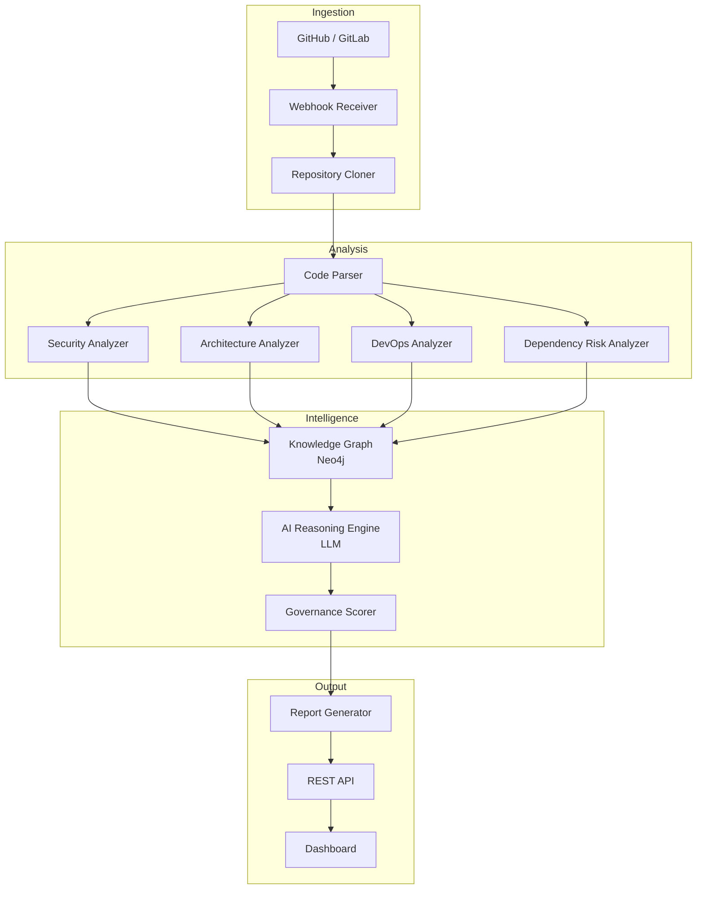

# Platform Overview

## What is the AI Engineering Intelligence Platform?

The AI Engineering Intelligence Platform (repo-intel) is an automated system that ingests software repositories and produces structured intelligence reports about code quality, architecture, security posture, DevOps maturity, and engineering governance.

It bridges the gap between raw source code and actionable engineering insights by combining static analysis tools, AI reasoning, and a knowledge graph — giving engineering leaders and developers a clear, prioritized view of where their codebase stands and what to improve.

---

## Core Value Proposition

| Without repo-intel | With repo-intel |
|--------------------|-----------------|
| Manual code reviews miss systemic patterns | AI synthesizes findings across the entire codebase |
| Security audits are point-in-time and expensive | Continuous security posture monitoring on every commit |
| Architecture drift is discovered too late | Governance scoring flags violations automatically |
| Onboarding takes weeks to understand a new repo | Intelligence report provides a 5-minute codebase briefing |
| Dependency risk is invisible | Supply chain and license risk surfaced proactively |

---

## Platform Capabilities

### 1. Repository Ingestion
- Clone repositories from GitHub, GitLab, Azure DevOps
- Extract metadata: language distribution, file counts, commit history
- Webhook-driven ingestion for continuous analysis

### 2. Code Analysis
- AST-based parsing via tree-sitter for 40+ languages
- Complexity metrics, test coverage estimation, duplication detection
- TODO/FIXME/HACK tracking across the codebase

### 3. Architecture Discovery
- Automatic detection of project type, layering, and patterns
- Dependency graph extraction and circular dependency detection
- Monorepo detection and bounded context identification

### 4. Security Analysis
- Secrets and credentials scanning (AWS keys, API tokens, passwords)
- Vulnerability pattern detection (injection, eval, insecure crypto)
- Sensitive file detection and .gitignore quality checks

### 5. DevOps Analysis
- CI/CD pipeline inspection (GitHub Actions, GitLab CI, Jenkins)
- Container best practices (Dockerfile, docker-compose)
- Infrastructure as Code detection (Terraform, Pulumi, CDK)

### 6. Dependency & Supply Chain Analysis
- Known CVE scanning via Trivy and OSV
- License risk classification
- Outdated package detection and upgrade paths

### 7. Knowledge Graph Generation
- Neo4j-backed graph of files, functions, classes, dependencies
- Cross-file relationship mapping
- Query interface for architectural questions

### 8. AI Reasoning Engine
- LLM-powered synthesis of all analysis findings
- Pattern recognition across skill dimensions
- Natural language insight generation and prioritization

### 9. Governance Scoring
- Architecture compliance scoring per policy ruleset
- Code health scoring per engineering standard
- Risk posture index for executive reporting

---

## Target Users

| Role | How they use it |
|------|----------------|
| **Engineering Manager** | Governance dashboards, risk scoring, team health trends |
| **Security Engineer** | Continuous secrets scanning, CVE monitoring, compliance reports |
| **Software Architect** | Architecture drift detection, dependency risk, design pattern analysis |
| **Developer** | Per-PR analysis, quick wins, specific file-level findings |
| **Engineering Director** | Portfolio-level health scores, roadmap inputs, due diligence reports |

---

## Analysis Output

Every analysis produces:

1. **Executive Summary** — 3-4 sentences: what is this project, how healthy is it, what is the single most important action
2. **Health Scorecard** — scored across 6 dimensions (0–10)
3. **Repository Overview** — key metrics table
4. **Prioritized Findings** — critical → high → medium → low, with file references and fixes
5. **Top 3 Quick Wins** — actionable in under one hour
6. **Recommended Roadmap** — this week / this month / this quarter

---

## Supported Languages

Primary support: JavaScript, TypeScript, Python, Go, Java, Kotlin, C#, Ruby, PHP, Rust

Secondary support: C, C++, Swift, Scala, Dart, Elixir, Haskell, Lua, R, MATLAB

Configuration files: JSON, YAML, TOML, HCL (Terraform), Dockerfile, shell scripts

---

## Architecture at a Glance

---

## Related Documents

- [Architecture](architecture.md) — detailed system architecture
- [System Design](system-design.md) — component design decisions
- [Development Roadmap](development-roadmap.md) — implementation phases
- [API Design](api-design.md) — REST API reference
