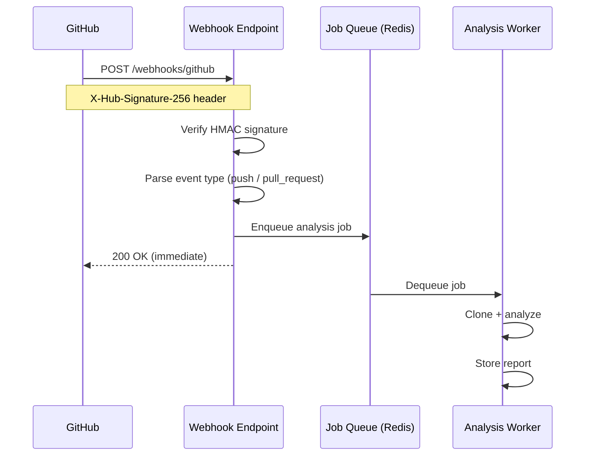

# Repository Ingestion

## Overview

The Repository Ingestion Layer is the entry point of the platform. It handles receiving analysis requests, authenticating with source control providers, cloning repositories, and extracting structured metadata before handing off to the analysis pipeline.

---

## Ingestion Modes

| Mode | Trigger | Use Case |
|------|---------|---------|
| **On-demand** | REST API call | Manual analysis, CI/CD integration |
| **Webhook** | GitHub/GitLab push event | Continuous analysis on every commit |
| **Scheduled** | Cron job | Daily health checks, portfolio monitoring |
| **Bulk import** | CSV of repo URLs | Initial onboarding of existing portfolio |

---

## Webhook Ingestion Flow



**Webhook endpoint implementation:**
```python
@router.post("/webhooks/github")
async def github_webhook(
    request: Request,
    background_tasks: BackgroundTasks,
    x_hub_signature: str = Header(alias="X-Hub-Signature-256")
):
    body = await request.body()

    # Verify signature
    expected = hmac.new(
        WEBHOOK_SECRET.encode(),
        body,
        hashlib.sha256
    ).hexdigest()
    if not hmac.compare_digest(f"sha256={expected}", x_hub_signature):
        raise HTTPException(status_code=401, detail="Invalid signature")

    event = await request.json()
    repo_url = event["repository"]["clone_url"]

    # Enqueue — return immediately to GitHub
    await job_queue.enqueue(AnalysisJob(repo_url=repo_url))
    return {"status": "queued"}
```

---

## Supported Source Control Providers

| Provider | Authentication | Clone URL Format |
|----------|---------------|-----------------|
| GitHub | Personal Access Token or GitHub App | `https://github.com/org/repo.git` |
| GitLab | Personal Access Token or Deploy Token | `https://gitlab.com/org/repo.git` |
| Azure DevOps | PAT or Service Principal | `https://dev.azure.com/org/project/_git/repo` |
| Bitbucket | App Password or OAuth | `https://bitbucket.org/org/repo.git` |
| Self-hosted Git | SSH key or token | Any valid git URL |

**Authentication configuration:**
```yaml
providers:
  github:
    token: ${GITHUB_TOKEN}        # env var
    app_id: ${GITHUB_APP_ID}      # optional: use GitHub App instead
    private_key_path: /secrets/github-app.pem
  gitlab:
    token: ${GITLAB_TOKEN}
    base_url: https://gitlab.com  # override for self-hosted
  azure_devops:
    token: ${AZURE_DEVOPS_TOKEN}
    organization: my-org
```

---

## Repository Cloning

### Shallow Clone Strategy

All repositories are cloned with `--depth 1` to minimize disk usage and clone time:

```bash
git clone \
  --depth 1 \
  --single-branch \
  --branch main \
  --no-tags \
  <authenticated-url> \
  /tmp/analysis/<run-id>/repo
```

For large repositories (>500MB), a sparse checkout is used to focus on source code:

```bash
git clone \
  --depth 1 \
  --filter=blob:limit=1m \
  --sparse \
  <url> \
  /tmp/analysis/<run-id>/repo

# Include only source directories
git sparse-checkout set src/ lib/ app/ test/ tests/
```

### Isolation

Each analysis run clones to a unique temp directory `/tmp/analysis/<run-id>/repo`. The directory is deleted after the analysis completes (Stage 7). Clones never share disk space between runs.

### Size Limits

| Limit | Default | Behavior when exceeded |
|-------|---------|----------------------|
| Max repo size | 2GB | Warn + use sparse checkout |
| Max file size | 10MB | Skip file, add informational note |
| Max analysis disk | 5GB total | Queue and wait for space |

---

## Metadata Extraction

After cloning, the following metadata is extracted before analysis begins:

```python
@dataclass
class RepoMetadata:
    repo_url: str
    clone_url: str
    default_branch: str
    latest_commit_sha: str
    latest_commit_date: datetime
    latest_commit_author: str
    total_files: int
    total_lines: int
    language_breakdown: dict[str, int]  # language -> file count
    primary_language: str
    framework_signals: list[str]        # detected frameworks
    has_readme: bool
    readme_lines: int
    clone_duration_ms: int
```

**Language detection:**
```python
def detect_languages(repo_path: Path) -> dict[str, int]:
    from pygments.lexers import guess_lexer_for_filename
    counts = defaultdict(int)

    for file_path in walk_source_files(repo_path):
        try:
            lexer = guess_lexer_for_filename(str(file_path))
            counts[lexer.name] += 1
        except ClassNotFound:
            counts["Unknown"] += 1

    return dict(counts)
```

---

## File Tree Exclusions

The following directories and patterns are excluded from analysis:

```python
EXCLUDED_DIRS = {
    "node_modules", ".git", "dist", "build", ".next", ".nuxt",
    "__pycache__", ".cache", "vendor", "venv", ".venv", "env",
    ".pytest_cache", "coverage", ".nyc_output", "target",
    "bin", "obj", ".gradle", ".idea", ".vscode"
}

EXCLUDED_EXTENSIONS = {
    ".jpg", ".jpeg", ".png", ".gif", ".ico", ".svg", ".woff",
    ".woff2", ".ttf", ".eot", ".pdf", ".zip", ".tar", ".gz",
    ".exe", ".dll", ".so", ".dylib", ".class", ".pyc"
}

MAX_FILE_SIZE_BYTES = 10 * 1024 * 1024  # 10MB
```

---

## Error Scenarios and Recovery

| Scenario | Response |
|----------|---------|
| Repository not found (404) | Return error: "Repository not found or access denied" |
| Authentication failure (401/403) | Return error: "Authentication failed — check token permissions" |
| Repository too large | Proceed with sparse checkout; note limitations in report |
| Network timeout during clone | Retry once with 30s timeout; then fail with error |
| Empty repository | Return minimal report noting the repo has no content |
| Private repository without token | Return error: "Repository is private — configure access token" |

---

## Webhook Setup Guide

### GitHub
1. Go to repository → Settings → Webhooks → Add webhook
2. Payload URL: `https://your-platform.com/webhooks/github`
3. Content type: `application/json`
4. Secret: copy the value from your platform config
5. Events: select "Push events" and "Pull requests"

### GitLab
1. Go to repository → Settings → Webhooks
2. URL: `https://your-platform.com/webhooks/gitlab`
3. Secret token: copy from platform config
4. Trigger: Push events, Merge request events

---

## Related Documents

- [Data Pipeline](data-pipeline.md)
- [Analysis Engines](analysis-engines.md)
- [API Design](api-design.md)
- [Deployment Architecture](deployment-architecture.md)
