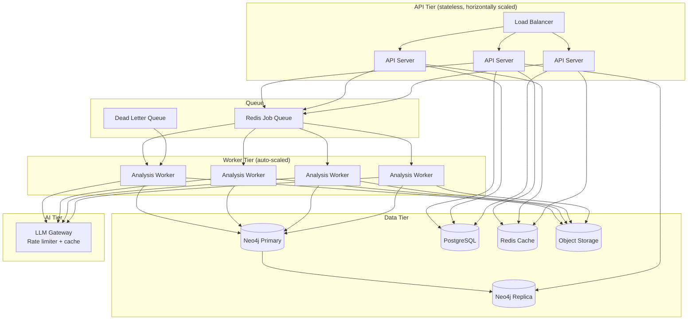

# Scalability

## Scaling Dimensions

The platform must scale across three axes:

| Axis | Challenge | Solution |
|------|----------|---------|
| **Repository Size** | 1M+ LOC repos, large file trees | Streaming parsing, sparse checkout, file size limits |
| **Analysis Volume** | Many repos analyzed concurrently | Horizontal worker scaling, job queue |
| **Query Load** | Many users querying knowledge graph | Read replicas, result caching, pagination |

---

## Horizontal Scaling Architecture



---

## Worker Auto-Scaling

Workers are stateless containers that pull jobs from a Redis queue. They scale based on queue depth:

```yaml
# Kubernetes HPA configuration
apiVersion: autoscaling/v2
kind: HorizontalPodAutoscaler
metadata:
  name: analysis-worker-hpa
spec:
  scaleTargetRef:
    apiVersion: apps/v1
    kind: Deployment
    name: analysis-worker
  minReplicas: 2
  maxReplicas: 20
  metrics:
    - type: External
      external:
        metric:
          name: redis_queue_depth
          selector:
            matchLabels:
              queue: analysis-jobs
        target:
          type: AverageValue
          averageValue: "5"  # scale when avg worker has >5 jobs waiting
```

**Scaling behavior:**
- Min 2 workers always running (handles baseline load)
- Scale up when queue depth > (workers × 5)
- Scale down after 5 minutes of low utilization
- Max 20 workers (LLM API rate limits are the ceiling)

---

## Repository Size Handling

| Repo Size | Strategy |
|-----------|---------|
| < 100MB | Full shallow clone |
| 100MB–500MB | Shallow clone with `--filter=blob:limit=5m` |
| 500MB–2GB | Sparse checkout (source dirs only) |
| > 2GB | Sparse checkout + file sampling for large dirs |

**File sampling for very large codebases:**
```python
def sample_large_directory(dir_path: Path, max_files: int = 500) -> list[Path]:
    """
    For directories with thousands of files, sample evenly across subdirectories
    to get representative coverage without analyzing every file.
    """
    all_files = list(walk_source_files(dir_path))
    if len(all_files) <= max_files:
        return all_files

    # Stratified sampling: take proportional samples from each subdir
    by_subdir = group_by_subdir(all_files)
    samples = []
    for subdir, files in by_subdir.items():
        n = max(1, round(max_files * len(files) / len(all_files)))
        samples.extend(random.sample(files, min(n, len(files))))

    return samples[:max_files]
```

---

## Caching Strategy

### Result Caching (Redis)

| Cache Key | TTL | Contents |
|-----------|-----|---------|
| `analysis:{repo_url}:{commit_sha}` | 24h | Full analysis result JSON |
| `ai_synthesis:{findings_hash}` | 48h | AI-generated summaries |
| `dep_scan:{lockfile_hash}` | 6h | Trivy/OSV scan results |
| `parsed_file:{file_hash}` | 7d | Tree-sitter AST for a file |

**Cache hit rate target: >70%** (most re-analyses of unchanged code should be cached)

### Knowledge Graph Read Replicas

Neo4j read replicas handle dashboard queries without touching the primary:
- Primary: all writes from analysis workers
- Replica 1 & 2: read queries from API tier (dashboards, reports)

---

## Job Queue Design

### Queue Priorities

```
HIGH PRIORITY:   webhook-triggered analyses (real-time, user is waiting)
NORMAL PRIORITY: on-demand API analyses
LOW PRIORITY:    scheduled batch analyses, portfolio scans
```

### Job Structure

```python
@dataclass
class AnalysisJob:
    job_id: str
    repo_url: str
    skills: list[str]
    priority: Literal["high", "normal", "low"]
    triggered_by: Literal["webhook", "api", "schedule"]
    callback_url: str | None   # optional webhook on completion
    created_at: datetime
    timeout_seconds: int = 600
```

### Dead Letter Queue

Jobs that fail 3 times are moved to the DLQ. Operators can inspect and retry:

```bash
# Inspect DLQ
redis-cli LRANGE analysis:dlq 0 -1

# Retry a failed job
curl -X POST /api/v1/jobs/{job_id}/retry
```

---

## Database Scaling

### PostgreSQL (metadata store)

- Stores: users, API keys, analysis run metadata, webhook configs
- Scaling: connection pooling via PgBouncer; read replica for reporting queries
- Expected size: small (< 1GB for 10,000 analyses)

### Neo4j (knowledge graph)

- Stores: full graph of files, findings, dependencies, relationships
- Scaling: Causal cluster for HA; read replicas for query load
- Expected size: 1–50GB depending on portfolio size
- Partitioning: consider separate databases per organization at scale

### Object Storage (S3/Azure Blob)

- Stores: generated HTML/MD reports, raw clone artifacts (optional)
- Scaling: inherently elastic
- Lifecycle: delete raw clones after 24h; keep reports indefinitely

---

## Performance Budgets

### Per-Analysis Budgets

| Stage | Budget | Action if exceeded |
|-------|--------|--------------------|
| Clone | 60s | Use sparse checkout |
| Parse | 30s | Sample large directories |
| Security scan (Semgrep) | 60s | Limit to critical rulesets |
| Dependency scan (Trivy) | 30s | Cache results by lockfile hash |
| AI synthesis | 30s | Use cached result if findings unchanged |
| **Total** | **< 3 minutes** | Partial report if over budget |

### API Response Budgets

| Endpoint | Budget |
|----------|--------|
| `POST /analyses` (trigger) | < 100ms (queues job, returns ID) |
| `GET /analyses/{id}` (status) | < 50ms |
| `GET /analyses/{id}/report.md` | < 200ms (from cache) |
| `GET /portfolio/scores` | < 500ms |

---

## Load Testing Targets

| Scenario | Target |
|----------|--------|
| Concurrent analyses | 50 simultaneous runs |
| API requests per second | 1,000 RPS |
| Repository size | Up to 1M LOC without degradation |
| Knowledge graph nodes | 100M nodes without query regression |
| Report storage | 1M+ reports stored |

---

## Related Documents

- [Deployment Architecture](deployment-architecture.md)
- [System Design](system-design.md)
- [Architecture](architecture.md)
