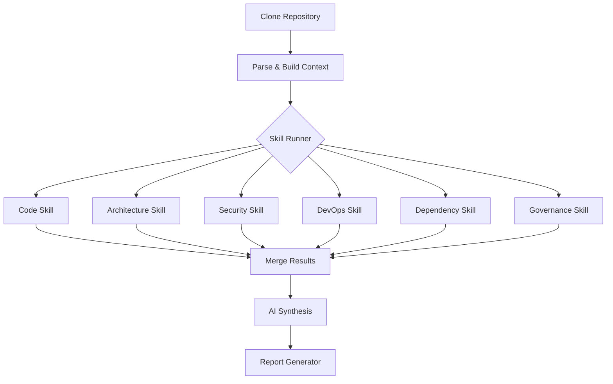
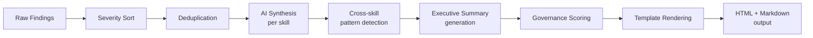
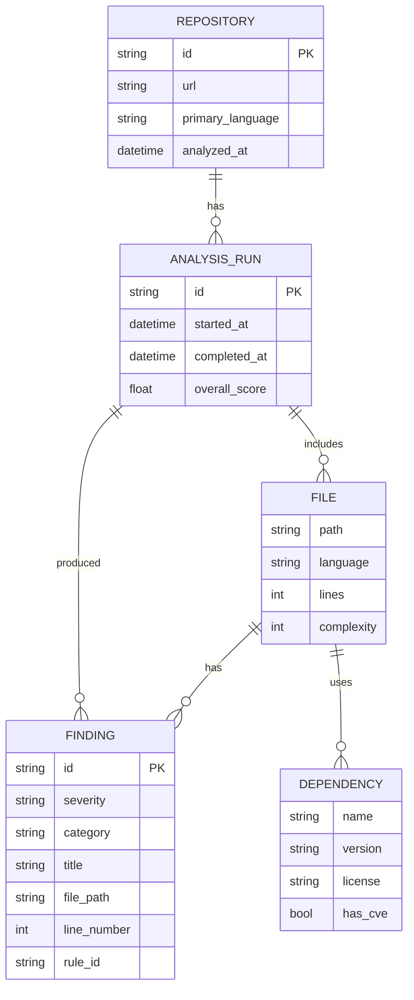

# System Design

## Design Goals

| Goal | Requirement |
|------|------------|
| **Accuracy** | Findings must reference specific files and line numbers |
| **Speed** | Analysis of a 100K-line repo completes in under 3 minutes |
| **Extensibility** | New analysis skills added without core changes |
| **Reliability** | Single skill failure does not fail the entire analysis |
| **Auditability** | Every finding is traceable to a specific detection rule |

---

## Core Abstractions

### Skill

A `Skill` is a self-contained analysis module. It receives a repository context and emits a list of `Finding` objects.

```python
class Skill(Protocol):
    name: str
    description: str

    def analyze(self, context: RepoContext) -> SkillResult:
        ...

@dataclass
class SkillResult:
    skill_name: str
    findings: list[Finding]
    metrics: dict[str, Any]
    score: int  # 0-10
    elapsed_ms: int
```

### Finding

```python
@dataclass
class Finding:
    severity: Literal["critical", "high", "medium", "low"]
    category: str           # e.g. "secrets", "complexity", "ci"
    title: str              # short description
    detail: str             # full explanation
    file_path: str | None
    line_number: int | None
    fix: str                # actionable recommendation
    rule_id: str            # traceability to detection rule
```

### RepoContext

```python
@dataclass
class RepoContext:
    repo_url: str
    local_path: Path
    primary_language: str
    languages: dict[str, int]   # language -> file count
    file_tree: list[FileNode]
    metadata: RepoMetadata
```

---

## Skill Execution Model

Skills run in parallel after the repository is cloned and parsed. Each skill receives the same `RepoContext`. A `SkillRunner` orchestrates execution with timeout and error isolation.



**Key design decisions:**
- Skills run concurrently via `asyncio.gather()` with a 120s per-skill timeout
- A skill that raises an exception is logged and skipped; other skills continue
- Findings from all skills are merged into a single sorted list before AI synthesis

---

## Report Generation Pipeline



### Deduplication

Findings with the same `rule_id` and `file_path` within 10 lines are considered duplicates. The highest-severity instance is kept.

### AI Synthesis

The AI layer receives:
- Structured findings per skill (JSON)
- Repository metadata
- Governance policy thresholds

It produces:
- Per-skill summary sentence
- Cross-skill pattern observations
- Executive summary (3-4 sentences)
- Top 3 quick wins
- Recommended roadmap (week / month / quarter)

---

## Knowledge Graph Schema

Every analysis run populates the knowledge graph. This enables historical trend queries and cross-repo comparison.



---

## Error Handling Strategy

| Failure Scenario | Behavior |
|-----------------|---------|
| Repository clone fails | Return error immediately; no analysis attempted |
| Individual skill times out (>120s) | Skip skill, mark as "timed out" in report |
| Individual skill raises exception | Skip skill, include error message in report |
| AI synthesis fails | Return report without AI summaries; raw findings included |
| Knowledge graph write fails | Log error; continue — graph is supplementary, not required |

---

## Configuration Model

```yaml
# config.yaml
analysis:
  skills:
    - code
    - architecture
    - security
    - devops
    - dependency
    - governance
  skill_timeout_seconds: 120
  parallel: true

ai:
  provider: anthropic          # or openai, azure-openai
  model: claude-sonnet-4-6
  max_tokens: 4096

governance:
  policies:
    - name: "No committed secrets"
      rule: "security.findings.critical == 0"
      blocking: true
    - name: "Minimum test coverage"
      rule: "code.metrics.test_ratio >= 0.3"
      blocking: false
    - name: "CI/CD required"
      rule: "devops.metrics.has_ci == true"
      blocking: false

output:
  formats:
    - markdown
    - html
  include_knowledge_graph: true
```

---

## API Contract

All analysis is initiated and retrieved via a REST API:

```
POST /api/v1/analyses
  Body: { "repo_url": "https://github.com/org/repo", "skills": ["all"] }
  Returns: { "analysis_id": "abc123", "status": "queued" }

GET /api/v1/analyses/{id}
  Returns: { "status": "complete", "report_url": "...", "score": 7.2 }

GET /api/v1/analyses/{id}/report.md
  Returns: Markdown report

GET /api/v1/analyses/{id}/report.html
  Returns: HTML report
```

Full API reference: [api-design.md](api-design.md)

---

## Performance Targets

| Metric | Target |
|--------|--------|
| Repository clone (shallow) | < 30s for repos up to 500MB |
| Full analysis (10K LOC repo) | < 60s |
| Full analysis (100K LOC repo) | < 3 minutes |
| Full analysis (1M LOC repo) | < 10 minutes |
| API response (report retrieval) | < 200ms |
| Knowledge graph write | < 5s per analysis run |

---

## Related Documents

- [Data Pipeline](data-pipeline.md)
- [AI Reasoning Engine](ai-reasoning-engine.md)
- [Analysis Engines](analysis-engines.md)
- [API Design](api-design.md)
