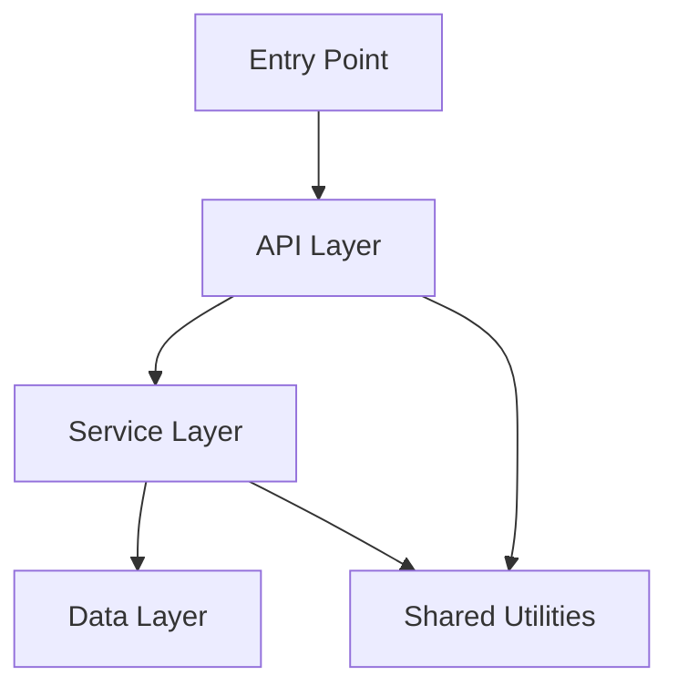
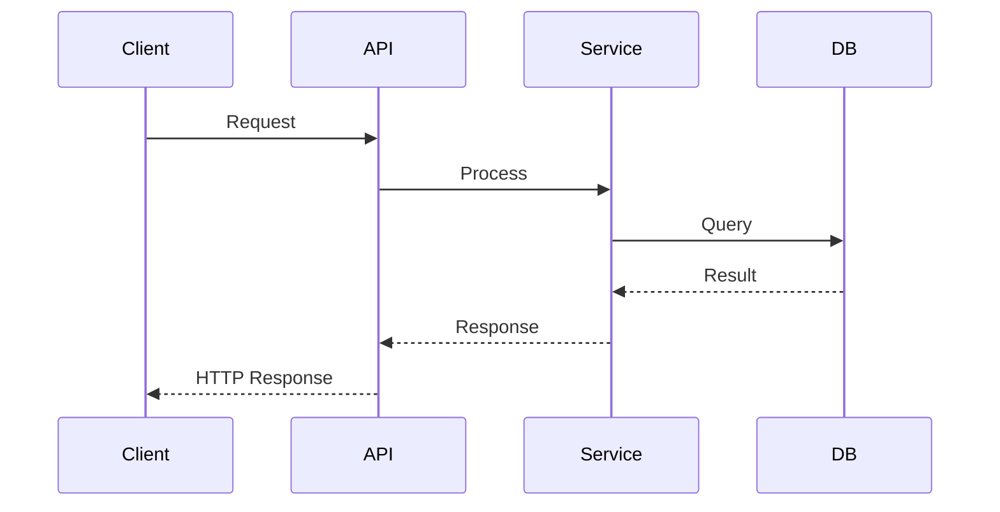

# 🔍 Repository Intelligence Report

**Repository:** <!-- URL -->
**Analyzed:** <!-- date and time -->
**Skills run:** <!-- code, architecture, security, devops, dependency, governance -->

---

## Executive Summary

<!-- 3–4 sentences. Answer: What is this project? How healthy is it? What is the single most important thing to fix? -->

---

## Health Scorecard

| Dimension       | Score         | Status            |
| --------------- | ------------- | ----------------- |
| Security        | <!-- x/10 --> | <!-- 🔴🟠🟡🟢 --> |
| Code Quality    | <!-- x/10 --> | <!-- 🔴🟠🟡🟢 --> |
| Architecture    | <!-- x/10 --> | <!-- 🔴🟠🟡🟢 --> |
| DevOps          | <!-- x/10 --> | <!-- 🔴🟠🟡🟢 --> |
| Dependency Risk | <!-- x/10 --> | <!-- 🔴🟠🟡🟢 --> |
| **Overall**     | <!-- x/10 --> | <!-- 🔴🟠🟡🟢 --> |

**Scoring guide:** 8–10 🟢 Good · 5–7 🟡 Needs work · 3–4 🟠 Poor · 0–2 🔴 Critical

**Overall score** = (security × 0.30) + (code × 0.25) + (architecture × 0.20) + (devops × 0.15) + (dependency × 0.10)

---

## Repository Overview

| Metric                  | Value |
| ----------------------- | ----- |
| Primary Language        |       |
| Project Type            |       |
| Total Files             |       |
| Total Lines of Code     |       |
| Test Files              |       |
| Estimated Test Coverage |       |
| CI/CD Platform          |       |
| Docker                  |       |
| IaC Tool                |       |
| Dependency Lock File    |       |
| Security Risk Level     |       |
| Governance Status       |       |

---

## 🚨 Critical & High Priority Findings

<!-- List ALL critical and high findings here, regardless of skill category -->
<!-- Format: SEVERITY · SKILL · Finding — File:line — Fix -->

---

## 📝 Code Quality

**Summary:** <!-- one sentence -->

**Metrics:**

- Languages:
- Total files / lines:
- Test coverage estimate:
- TODO/FIXME count:

**Findings:**

<!-- medium and low findings for this skill -->

---

## 🏗️ Architecture

**Summary:** <!-- one sentence -->

**Metrics:**

- Project type:
- Direct dependencies:
- Monorepo:
- Layered structure:
- Lock file:

**Findings:**

<!-- medium and low findings for this skill -->

---

## 🗺️ Architecture Diagrams

### Logical Architecture

<!-- Mermaid diagram showing module layers and static dependencies.
     Generated by the architecture skill from actual directory/import structure. -->

### Functional Flow

<!-- Mermaid diagram tracing the primary runtime flow through the system.
     Use sequenceDiagram for multi-service flows, flowchart LR for single-process. -->

---

## 🔒 Security

**Risk Level:** <!-- CRITICAL / HIGH / MEDIUM / LOW -->

**Summary:** <!-- one sentence -->

**Findings:**

<!-- all security findings including those already listed above -->

---

## ⚙️ DevOps

**Summary:** <!-- one sentence -->

**Checklist:**

- [ ] CI/CD pipeline
- [ ] Tests in CI
- [ ] Security scan in CI
- [ ] Docker
- [ ] IaC
- [ ] README
- [ ] LICENSE
- [ ] CHANGELOG
- [ ] Lock file
- [ ] SECURITY.md
- [ ] Dependabot

**Findings:**

<!-- medium and low findings for this skill -->

---

## 📦 Dependency Risk

**Summary:** <!-- one sentence -->

**Metrics:**

- Package manager:
- Lock file present:
- Critical CVEs:
- High CVEs:
- Deprecated packages:
- License issues:

**Findings:**

<!-- dependency findings -->

---

## 🏛️ Governance Assessment

**Status:** <!-- ✅ COMPLIANT / ⚠️ CONDITIONALLY COMPLIANT / ❌ NON-COMPLIANT -->
**Overall Score:** <!-- x.x/10 -->
**Risk Posture Index:** <!-- RPI/100 🔴🟠🟡🟢 -->

**Policy Results:**

| Policy                | Status           | Severity |
| --------------------- | ---------------- | -------- |
| No committed secrets  | <!-- ✅ / ❌ --> | Critical |
| Security score ≥ 5    | <!-- ✅ / ❌ --> | High     |
| No critical CVEs      | <!-- ✅ / ❌ --> | Critical |
| Test coverage ≥ 10%   | <!-- ✅ / ❌ --> | High     |
| CI/CD pipeline exists | <!-- ✅ / ❌ --> | High     |
| Lock file present     | <!-- ✅ / ❌ --> | Medium   |
| No files > 3000 lines | <!-- ✅ / ❌ --> | Medium   |

<!-- Describe blocking violations and advisory violations -->

---

## 🎯 Quick Wins

Things that can be fixed in under an hour with high impact:

<!-- List ALL quick wins identified. Each should be specific, actionable, with file reference -->

---

## 🗺️ Recommended Roadmap

### This week (critical fixes)

<!-- items from critical/high findings -->

### This month (quality improvements)

<!-- items from medium findings -->

### This quarter (strategic improvements)

<!-- architectural or process improvements -->

---

## Findings Summary

| Severity    | Count |
| ----------- | ----- |
| 🔴 Critical |       |
| 🟠 High     |       |
| 🟡 Medium   |       |
| 🔵 Low      |       |
| **Total**   |       |

---

## 🤖 Claude Run Metrics

> Token counts are **estimates** derived from file sizes and conversation content.

| Metric               | Value                                  |
| -------------------- | -------------------------------------- |
| Model                | <!-- e.g. claude-sonnet-4-6 -->        |
| Run date             | <!-- ISO 8601 date/time -->            |
| Run duration         | <!-- e.g. 4m 32s -->                   |
| Input tokens (est.)  | <!-- integer -->                       |
| Output tokens (est.) | <!-- integer -->                       |
| Total tokens (est.)  | <!-- integer -->                       |
| Context window       | 200,000 tokens                         |
| Context utilization  | <!-- e.g. 14.2% 🟢 Low -->             |
| Memory files loaded  | <!-- list paths + sizes, or "none" --> |
| Tool calls (total)   | <!-- integer -->                       |
| — Bash               | <!-- integer -->                       |
| — Read               | <!-- integer -->                       |
| — Write / Edit       | <!-- integer -->                       |
| — Grep / Glob        | <!-- integer -->                       |
| — Agent (subagents)  | <!-- integer -->                       |
| Repo files inspected | <!-- integer -->                       |

---

_Generated by repo-intel · https://github.com/sumsankar/repo-intel_
