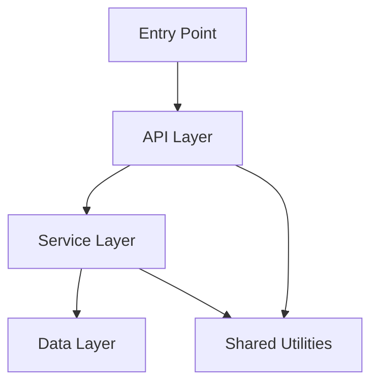
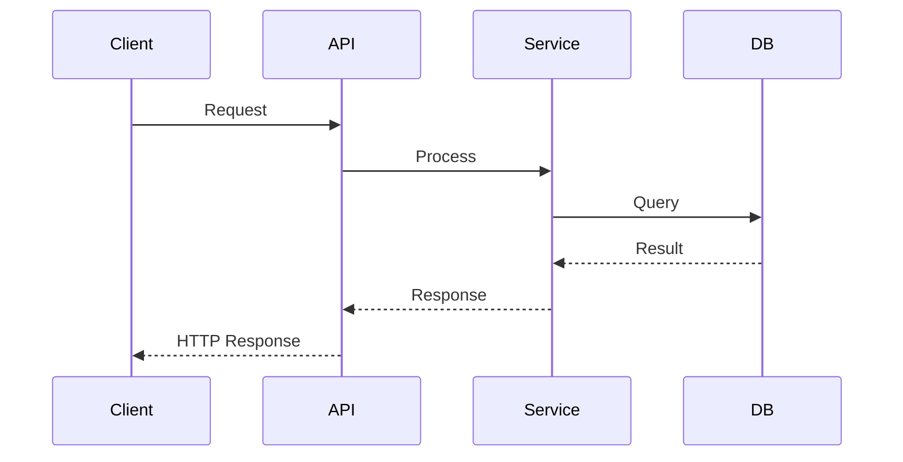

# 🔍 Repository Intelligence Report

**Repository:** <!-- URL -->
**Analyzed:** <!-- date and time -->
**Skills run:** <!-- code, architecture, security, devops, dependency, governance -->

---

**Status:** <!-- ✅ COMPLIANT / ⚠️ CONDITIONALLY COMPLIANT / ❌ NON-COMPLIANT -->
| Overall Score | RPI | Critical | High | Medium | Low | Total Findings |
| ------------- | --- | -------- | ---- | ------ | --- | -------------- |
| <!-- x.x/10 --> | <!-- x/100 --> | <!-- n --> | <!-- n --> | <!-- n --> | <!-- n --> | <!-- n --> |

---

## Executive Summary

<!-- 3–4 sentences. Answer: What is this project? How healthy is it? What is the single most important thing to fix? -->

---

## Repository Overview

| Metric                  | Value |
| ----------------------- | ----- |
| Primary Language        |       |
| Project Type            |       |
| Total Files             |       |
| Total Lines of Code     |       |
| Test Files              |       |
| Estimated Test Coverage |       |
| CI/CD Platform          |       |
| Docker                  |       |
| IaC Tool                |       |
| Dependency Lock File    |       |
| Security Risk Level     |       |
| Governance Status       |       |

---

## Health Scorecard

| Dimension       | Score         | Status            |
| --------------- | ------------- | ----------------- |
| Security        | <!-- x/10 --> | <!-- 🔴🟠🟡🟢 --> |
| Code Quality    | <!-- x/10 --> | <!-- 🔴🟠🟡🟢 --> |
| Architecture    | <!-- x/10 --> | <!-- 🔴🟠🟡🟢 --> |
| DevOps          | <!-- x/10 --> | <!-- 🔴🟠🟡🟢 --> |
| Dependency Risk | <!-- x/10 --> | <!-- 🔴🟠🟡🟢 --> |
| **Overall**     | <!-- x/10 --> | <!-- 🔴🟠🟡🟢 --> |

**Scoring guide:** 8–10 🟢 Good · 5–7 🟡 Needs work · 3–4 🟠 Poor · 0–2 🔴 Critical

**Overall score** = (security × 0.30) + (code × 0.25) + (architecture × 0.20) + (devops × 0.15) + (dependency × 0.10)

### Score Breakdown

| Dimension       | Score         | Weight | Contribution       | Key Driver |
| --------------- | ------------- | ------ | ------------------ | ---------- |
| Security        | <!-- x/10 --> | 30%    | <!-- score×0.30 --> |            |
| Code Quality    | <!-- x/10 --> | 25%    | <!-- score×0.25 --> |            |
| Architecture    | <!-- x/10 --> | 20%    | <!-- score×0.20 --> |            |
| DevOps          | <!-- x/10 --> | 15%    | <!-- score×0.15 --> |            |
| Dependency Risk | <!-- x/10 --> | 10%    | <!-- score×0.10 --> |            |
| **Overall**     | <!-- x/10 --> | 100%   | <!-- total -->      |            |

### Score Derivation Details

<!-- For each dimension, list the factors that contributed to its score.
     This helps users understand exactly how scores were calculated. -->

#### 🔒 Security — <!-- x/10 -->

| Factor | Finding | Impact |
| ------ | ------- | ------ |
<!-- Example rows:
| Committed secrets | 2 API keys found in config files | −3.0 |
| SQL / command injection | No injection vulnerabilities found | +0.0 (baseline) |
| CORS configuration | Wildcard CORS in production config | −1.5 |
| Dependency CVEs | 3 critical, 5 high CVEs | −2.0 |
| Auth & session handling | JWT tokens properly validated | +0.0 (baseline) |
| Input validation | Missing validation on 4 API endpoints | −0.5 |

Factor categories: Committed secrets, SQL/command injection, XSS vulnerabilities,
CORS configuration, Auth & session handling, Dependency CVEs, Input validation,
Security headers, Sensitive data exposure, Cryptography -->

> **Scoring method:** Starts at 10.0. Each finding deducts points by severity (Critical: −2.0 to −3.0, High: −1.0 to −2.0, Medium: −0.5 to −1.0, Low: −0.25). Minimum 0.

#### 📝 Code Quality — <!-- x/10 -->

| Factor | Finding | Impact |
| ------ | ------- | ------ |
<!-- Example rows:
| Test coverage | ~45% estimated (112 test files) | +0.0 (adequate) |
| TODO/FIXME density | 23 TODOs, 4 in critical paths | −0.5 |
| Empty catch blocks | 8 empty catch blocks swallowing errors | −1.0 |
| File size | 2 files exceed 3000 lines | −0.5 |
| Code duplication | Moderate duplication in service layer | −0.5 |

Factor categories: Test coverage, TODO/FIXME density, Empty catch blocks,
File size, Code duplication, Naming consistency, Dead code, Error handling,
Type safety, Complexity -->

> **Scoring method:** Starts at 10.0. Deductions for missing tests (−1.0 to −3.0), code smells (−0.25 to −1.0 each), large files (−0.5 each), poor error handling (−0.5 to −1.0).

#### 🏗️ Architecture — <!-- x/10 -->

| Factor | Finding | Impact |
| ------ | ------- | ------ |
<!-- Example rows:
| Layered structure | Clear separation: controllers → services → repos | +0.0 (baseline) |
| Circular dependencies | 2 circular dependency chains detected | −1.5 |
| Dependency count | 142 direct dependencies (high for project size) | −0.5 |

Factor categories: Layered structure, Circular dependencies, Dependency count,
Framework version consistency, API design patterns, Separation of concerns,
Configuration management, Module cohesion, Coupling -->

> **Scoring method:** Starts at 10.0. Circular deps: −1.0 to −2.0. Missing layered structure: −1.5. Tight coupling: −0.5 to −1.5. Inconsistent framework versions: −0.5.

#### ⚙️ DevOps — <!-- x/10 -->

| Factor | Finding | Impact |
| ------ | ------- | ------ |
<!-- Example rows:
| CI/CD pipeline | GitHub Actions with build + test | +0.0 (baseline) |
| Tests in CI | Unit tests run on every PR | +0.0 (baseline) |
| Security scanning | No SAST/DAST in pipeline | −1.5 |
| Docker image pinning | Using :latest tags | −0.5 |

Factor categories: CI/CD pipeline, Tests in CI, Security scanning in CI,
Docker, Infrastructure as Code, Lock file, README quality, LICENSE,
CHANGELOG, SECURITY.md, Dependabot/Renovate -->

> **Scoring method:** Starts at 10.0. No CI/CD: −3.0. No tests in CI: −1.5. No security scanning: −1.5. Missing lock file: −1.0. Missing README: −0.5. Missing LICENSE: −0.5.

#### 📦 Dependency Risk — <!-- x/10 -->

| Factor | Finding | Impact |
| ------ | ------- | ------ |
<!-- Example rows:
| Critical CVEs | 0 critical vulnerabilities | +0.0 (baseline) |
| High CVEs | 3 high-severity vulnerabilities | −1.5 |
| Deprecated packages | 5 deprecated runtime dependencies | −1.0 |
| License compliance | 1 GPL-licensed transitive dependency | −0.5 |
| Lock file | package-lock.json present and current | +0.0 (baseline) |

Factor categories: Critical CVEs, High CVEs, Medium/Low CVEs,
Deprecated packages, License compliance, Lock file, Outdated dependencies,
Dependency count, Pinning strategy, Transitive dependency risk -->

> **Scoring method:** Starts at 10.0. Each critical CVE: −2.0. Each high CVE: −0.5. Deprecated deps: −0.5 to −1.5. License issues: −0.5 each. Missing lock file: −1.0.

---

## 🔒 Security Findings

**Risk Level:** <!-- CRITICAL / HIGH / MEDIUM / LOW -->

**Summary:** <!-- one sentence -->

**Findings:**

<!-- Format for each finding:
### SEVERITY · [category] Finding title
**File:** path/to/file.ext · Lines X–Y

Description of the finding.

**Fix:** Specific remediation steps.
-->

---

## 📝 Code Quality

**Summary:** <!-- one sentence -->

**Metrics:**

- Languages:
- Total files / lines:
- Test coverage estimate:
- TODO/FIXME count:

**Findings:**

<!-- medium and low findings for this skill -->

---

## 🏗️ Architecture

**Summary:** <!-- one sentence -->

**Metrics:**

- Project type:
- Direct dependencies:
- Monorepo:
- Layered structure:
- Lock file:

**Findings:**

<!-- medium and low findings for this skill -->

---

## 🗺️ Architecture Diagrams

### Logical Architecture

<!-- Mermaid diagram showing module layers and static dependencies.
     Generated by the architecture skill from actual directory/import structure. -->

### Functional Flow

<!-- Mermaid diagram tracing the primary runtime flow through the system.
     Use sequenceDiagram for multi-service flows, flowchart LR for single-process. -->

---

## ⚙️ DevOps

**Summary:** <!-- one sentence -->

**Checklist:**

- [ ] CI/CD pipeline
- [ ] Tests in CI
- [ ] Security scan in CI
- [ ] Docker
- [ ] IaC
- [ ] README
- [ ] LICENSE
- [ ] CHANGELOG
- [ ] Lock file
- [ ] SECURITY.md
- [ ] Dependabot

**Findings:**

<!-- medium and low findings for this skill -->

---

## 📦 Dependency Risk

**Summary:** <!-- one sentence -->

**Metrics:**

- Package manager:
- Lock file present:
- Critical CVEs:
- High CVEs:
- Deprecated packages:
- License issues:

**Findings:**

<!-- dependency findings -->

---

## 🏛️ Governance Assessment

**Status:** <!-- ✅ COMPLIANT / ⚠️ CONDITIONALLY COMPLIANT / ❌ NON-COMPLIANT -->
**Overall Score:** <!-- x.x/10 -->
**Risk Posture Index:** <!-- RPI/100 🔴🟠🟡🟢 -->

### RPI Calculation

| Severity  | Count        | Weight | Raw Score          |
| --------- | ------------ | ------ | ------------------ |
| Critical  | <!-- n -->   | ×25    | <!-- n×25 -->      |
| High      | <!-- n -->   | ×10    | <!-- n×10 -->      |
| Medium    | <!-- n -->   | ×3     | <!-- n×3 -->       |
| Low       | <!-- n -->   | ×1     | <!-- n×1 -->       |
| **Total** |              |        | **<!-- total -->**  |

**RPI = max(0, 100 − total/2)** → <!-- RPI/100 -->

**Policy Results:**

| Policy                | Status           | Severity |
| --------------------- | ---------------- | -------- |
| No committed secrets  | <!-- ✅ / ❌ --> | Critical |
| Security score ≥ 5    | <!-- ✅ / ❌ --> | High     |
| No critical CVEs      | <!-- ✅ / ❌ --> | Critical |
| Test coverage ≥ 10%   | <!-- ✅ / ❌ --> | High     |
| CI/CD pipeline exists | <!-- ✅ / ❌ --> | High     |
| Lock file present     | <!-- ✅ / ❌ --> | Medium   |
| No files > 3000 lines | <!-- ✅ / ❌ --> | Medium   |
| No SQL/command injection  | <!-- ✅ / ❌ --> | Critical |
| CORS not wildcard in prod | <!-- ✅ / ❌ --> | High     |
| No deprecated runtime deps| <!-- ✅ / ❌ --> | High     |
| No GPL/AGPL licensed deps | <!-- ✅ / ❌ --> | Medium   |
| Tests run in CI           | <!-- ✅ / ❌ --> | High     |
| Docker images pinned      | <!-- ✅ / ❌ --> | Medium   |
| README substantive        | <!-- ✅ / ❌ --> | Low      |
| No circular dependencies  | <!-- ✅ / ❌ --> | Medium   |
| Consistent framework vers | <!-- ✅ / ❌ --> | Medium   |
| Clear layered structure   | <!-- ✅ / ❌ --> | Medium   |
| No empty catch blocks     | <!-- ✅ / ❌ --> | Medium   |
| No TODO in critical paths | <!-- ✅ / ❌ --> | Low      |

<!-- Describe blocking violations and advisory violations -->

---

## 🎯 Quick Wins

Things that can be fixed in under an hour with high impact:

<!-- Format:
1. **Short title.** Description with specific file reference.
2. **Short title.** Description.
-->

---

## 🗺️ Recommended Roadmap

### This week (critical fixes)

<!-- items from critical/high findings -->

### This month (quality improvements)

<!-- items from medium findings -->

### This quarter (strategic improvements)

<!-- architectural or process improvements -->

---

## Findings Summary

| Severity    | Count |
| ----------- | ----- |
| 🔴 Critical |       |
| 🟠 High     |       |
| 🟡 Medium   |       |
| 🔵 Low      |       |
| **Total**   |       |

---

## 🤖 Claude Run Metrics

> Token counts are **estimates** derived from file sizes and conversation content.

| Metric               | Value                                  |
| -------------------- | -------------------------------------- |
| Model                | <!-- e.g. claude-sonnet-4-6 -->        |
| Run date             | <!-- ISO 8601 date/time -->            |
| Run duration         | <!-- e.g. 4m 32s -->                   |
| Input tokens (est.)  | <!-- integer -->                       |
| Output tokens (est.) | <!-- integer -->                       |
| Total tokens (est.)  | <!-- integer -->                       |
| Context window       | 200,000 tokens                         |
| Context utilization  | <!-- e.g. 14.2% 🟢 Low -->             |
| Memory files loaded  | <!-- list paths + sizes, or "none" --> |
| Tool calls (total)   | <!-- integer -->                       |
| — Bash               | <!-- integer -->                       |
| — Read               | <!-- integer -->                       |
| — Write / Edit       | <!-- integer -->                       |
| — Grep / Glob        | <!-- integer -->                       |
| — Agent (subagents)  | <!-- integer -->                       |
| Repo files inspected | <!-- integer -->                       |

---

_Generated by repo-intel · https://github.com/sumsankar/repo-intel_
