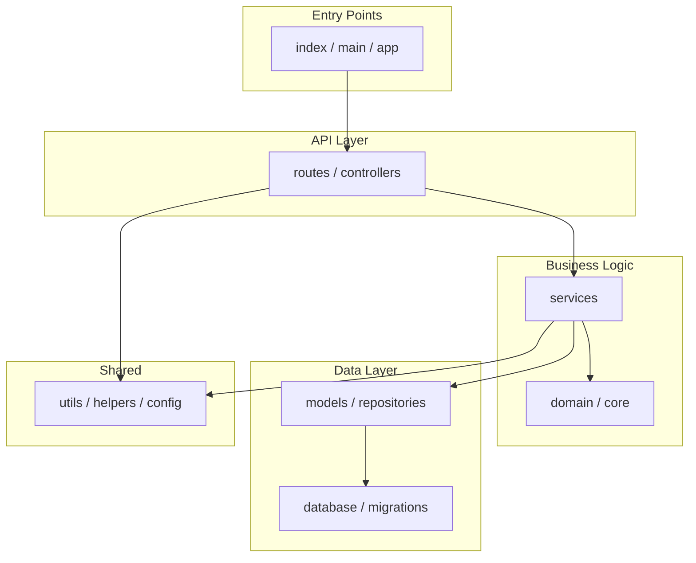
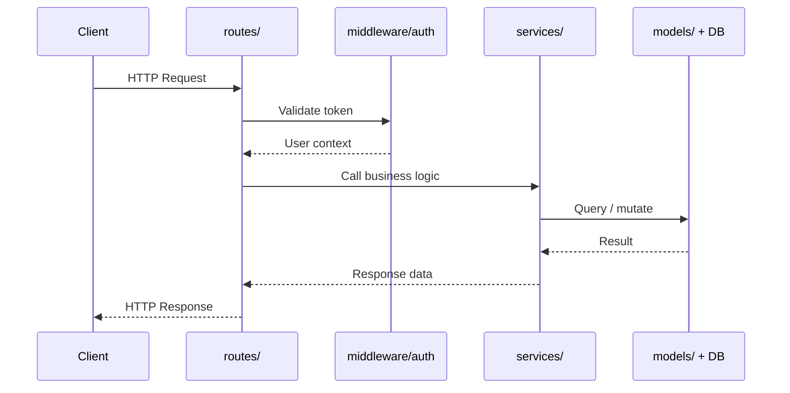

# Skill: Architecture Analysis

Analyze the repository's structure, design patterns, design principles, dependencies, coupling, and architectural health across **all projects in the solution**.

---

## What to detect

### 1. Project type and tech stack identification

Identify **all** project types present by scanning for these files:

| File found                                           | Project type                  |
| ---------------------------------------------------- | ----------------------------- |
| `*.sln` + `*.csproj`                                 | .NET Solution                 |
| `*.csproj` with `Microsoft.NET.Sdk.Web`              | ASP.NET Core Web API / MVC    |
| `*.csproj` with `Microsoft.NET.Sdk.Worker`           | .NET Worker Service           |
| `*.csproj` with `Microsoft.NET.Sdk.BlazorWebAssembly`| Blazor WebAssembly            |
| `package.json` + `tsconfig.json`                     | TypeScript / Node.js          |
| `package.json` + React/Next/Angular/Vue in deps      | SPA Framework                 |
| `next.config.js` or `next.config.ts`                 | Next.js                       |
| `angular.json`                                       | Angular                       |
| `nuxt.config.ts`                                     | Nuxt.js                       |
| `requirements.txt` or `pyproject.toml`               | Python                        |
| `manage.py` + `settings.py`                          | Django                        |
| `app.py` or `wsgi.py` + Flask in deps                | Flask                         |
| `pom.xml` or `build.gradle`                          | Java / Kotlin                 |
| `pom.xml` with Spring Boot parent                    | Spring Boot                   |
| `go.mod`                                             | Go                            |
| `Cargo.toml`                                         | Rust                          |
| `Gemfile`                                            | Ruby / Rails                  |
| `composer.json`                                      | PHP / Laravel                 |
| `pubspec.yaml`                                       | Dart / Flutter                |
| `mix.exs`                                            | Elixir / Phoenix              |
| `Package.swift`                                      | Swift                         |

**For .NET solutions**, also detect:
```bash
# List all projects in solution
find . -name "*.sln" -exec cat {} \; 2>/dev/null | grep "Project("

# Identify project types from SDK
find . -name "*.csproj" -exec grep -l "Sdk=" {} \; | while read f; do
  echo "$f: $(grep 'Sdk=' $f | head -1)"
done

# Detect target frameworks
find . -name "*.csproj" -exec grep -H "TargetFramework" {} \;
```

**For Java/Kotlin**, also detect:
```bash
# Maven multi-module
cat pom.xml 2>/dev/null | grep -A1 "<modules>"

# Gradle multi-project
cat settings.gradle settings.gradle.kts 2>/dev/null | grep "include"
```

### 2. Directory structure & layering

- List top-level directories (excluding `node_modules`, `.git`, `dist`, `build`)
- Identify if there is a clear layered structure:
  - Good patterns: `src/`, `lib/`, `api/`, `services/`, `models/`, `controllers/`, `middleware/`, `utils/`
  - Flag if everything is flat at the root
- Detect monorepo: look for `packages/`, `apps/`, `pnpm-workspace.yaml`, `lerna.json`, `turbo.json`

### 3. Dependency analysis

**For Node.js — read `package.json`:**

- Count direct dependencies vs devDependencies
- Flag if direct deps > 50 (bloat risk)
- Flag exact version pins (e.g. `"lodash": "4.17.21"` vs `"^4.17.21"`) — exact pins block security patches
- Look for obviously duplicated functionality (e.g. both `moment` and `date-fns`)
- Check if a lock file exists (`package-lock.json`, `yarn.lock`, `pnpm-lock.yaml`)

**For Python — read `requirements.txt` or `pyproject.toml`:**

- Count dependencies
- Flag unpinned dependencies (no version specified)

### 4. Circular dependency signals (JS/TS)

Scan import statements for obvious cycles:

```bash
# Find all import/require statements
grep -r "from '\.\." src/ --include="*.ts" --include="*.js" | head -50
grep -r "require('\.\." src/ --include="*.js" | head -50
```

Flag if modules in the same layer import each other (e.g. service A imports service B imports service A).

### 5. Design pattern signals

Look for evidence of:

- **Dependency injection** (constructor parameters, `@Injectable`, `@Inject`, DI containers, `IServiceCollection`, `Depends()`)
- **Repository pattern** (files named `*Repository`, `*Store`, `*DAO`)
- **Factory pattern** (files named `*Factory`, `*Builder`, `*Creator`)
- **Mediator / CQRS** (MediatR, `IRequest`, `IRequestHandler`, command/query separation)
- **Event-driven** (EventEmitter, message queues, pub/sub, `INotification`, domain events)
- **Clean Architecture / Onion** (separate Domain, Application, Infrastructure, Presentation layers)
- **Middleware pipeline** (Express middleware, ASP.NET middleware, Django middleware)
- **Strategy pattern** (files named `*Strategy`, `*Policy`, interface-based behavior selection)
- **Observer pattern** (event handlers, subscribers, listeners)
- **God objects** — single files/classes doing too many unrelated things

### 5.1. Design principles assessment

Evaluate adherence to design principles:

- **SOLID violations:**
  - **SRP** — classes/files with multiple unrelated responsibilities (flag files with 5+ public methods spanning different domains)
  - **OCP** — long switch/if-else chains that must be modified for each new case
  - **LSP** — subclasses that throw NotImplementedException or override base behavior incompatibly
  - **ISP** — large interfaces with many methods that most implementors don't need
  - **DIP** — concrete class dependencies instead of abstractions (e.g., `new SqlConnection()` in business logic)
- **DRY violations** — duplicated logic across services, copy-pasted configuration
- **KISS violations** — over-engineered abstractions, unnecessary indirection layers
- **Separation of concerns** — business logic mixed with data access, UI logic in controllers

```bash
# Detect SOLID violations (examples)
# SRP: files with many public methods
grep -rn "public.*(" --include="*.cs" --include="*.java" --include="*.ts" . | \
  awk -F: '{print $1}' | sort | uniq -c | sort -rn | head -10

# DIP: direct instantiation of infrastructure in business logic
grep -rn "new SqlConnection\|new HttpClient\|new SmtpClient" --include="*.cs" . | grep -v test | grep -v Test
grep -rn "new MongoClient\|DriverManager.getConnection" --include="*.java" . | grep -v test

# OCP: long switch statements
grep -c "case " --include="*.cs" --include="*.java" --include="*.ts" -r . | awk -F: '$2 > 10 {print}'
```

### 6. Multi-project and monorepo analysis

**For .NET solutions:**
```bash
# List all project references (inter-project dependencies)
find . -name "*.csproj" -exec grep -H "ProjectReference" {} \;

# Detect shared libraries vs. application projects
find . -name "*.csproj" -exec grep -H "OutputType" {} \;

# Check for inconsistent framework versions across projects
find . -name "*.csproj" -exec grep -H "TargetFramework" {} \; | sort -t: -k2

# Detect NuGet package version inconsistencies across projects
find . -name "*.csproj" -exec grep -H "PackageReference" {} \; | sort
# Check for Directory.Build.props (centralized build settings)
find . -name "Directory.Build.props" -o -name "Directory.Packages.props"
```

**For monorepos:**
```bash
# Detect workspace tools
ls pnpm-workspace.yaml lerna.json turbo.json nx.json rush.json 2>/dev/null

# List all packages/apps
ls packages/ apps/ services/ libs/ 2>/dev/null

# Check for shared dependencies across packages
find ./packages -name "package.json" -exec grep -l "dependencies" {} \;

# Detect circular package dependencies
# Look for packages that import each other
```

**For Java multi-module:**
```bash
# List modules and their dependencies
find . -name "pom.xml" -exec grep -H "<dependency>" {} \; | head -30
find . -name "build.gradle" -exec grep -H "implementation project" {} \;
```

Flag these multi-project issues:
- Circular project references
- Inconsistent framework/SDK versions across projects
- Shared libraries without clear ownership
- Diamond dependency problems (A depends on B and C, both depend on different versions of D)
- Missing centralized build configuration (no `Directory.Build.props` for .NET, no parent POM for Maven)

### 7. Diagram generation

After completing all other architecture analysis, synthesize your findings into two Mermaid diagrams. These diagrams must reflect only what was actually discovered — do not invent components.

#### Logical Architecture Diagram

Show the **static module structure**: layers, key directories/modules, and how they depend on each other.

Rules:

- Use `graph TD` (top-down) layout
- Group nodes by layer using `subgraph` blocks (e.g. `subgraph API`, `subgraph Services`, `subgraph Data`)
- Arrows represent import/call dependencies, not data flow
- Label each node with the actual directory or module name found
- If the project is flat with no clear layering, use a single level with all top-level modules as nodes
- Keep it readable: max ~15 nodes. Collapse similar siblings into one representative node if needed

**Template:**



#### Functional Flow Diagram

Show the **primary runtime flow**: trace the most important user action or request through the system end-to-end.

Rules:

- Use `sequenceDiagram` if the flow crosses multiple services/actors; use `flowchart LR` for a single-process flow
- Pick the single most representative flow (e.g. "API request → auth → service → DB → response" or "user submits form → validation → persistence → email")
- Use real module/file names found in the repo, not generic labels
- Annotate key steps (e.g. auth check, DB write, cache hit)
- Include error/failure paths only if they are architecturally significant

**Template (adapt based on project type):**



**Output both diagrams as fenced Mermaid code blocks in the report.** Label them clearly as "Logical Architecture" and "Functional Flow".

> **CRITICAL:** Both diagrams are REQUIRED in every report — even for non-code repos (docs-only, prompt libraries, config-only). If there is no runtime flow, model the static information flow (e.g. user → ANALYZE.md → skill files → report output). Never skip or omit this section.

## How to analyze

```bash
# Top-level structure
ls -la | grep "^d"

# Dependency count (Node.js)
cat package.json | python3 -c "import json,sys; p=json.load(sys.stdin); print('direct:', len(p.get('dependencies',{})), 'dev:', len(p.get('devDependencies',{})))"

# Check for lock file
ls package-lock.json yarn.lock pnpm-lock.yaml 2>/dev/null

# Find largest directories (complexity hotspots)
du -sh */ 2>/dev/null | sort -rh | head -10

# Count files per top-level directory
for dir in */; do echo "$dir: $(find $dir -type f | grep -v node_modules | wc -l) files"; done
```

---

## Findings format

- **Severity**: critical / high / medium / low
- **Category**: structure / dependencies / coupling / patterns
- **Finding**: specific observation
- **Location**: file or directory
- **Fix**: concrete recommendation

---

## Example findings

- 🟠 **High** `[dependencies]` 73 direct dependencies in `package.json`. Run `npx depcheck` to identify unused ones.
- 🟠 **High** `[coupling]` No lock file found. `npm install` may produce different results across environments.
- 🟡 **Medium** `[structure]` All 140 source files are in a flat `/src` directory. Group by feature or layer (services/, models/, routes/).
- 🟡 **Medium** `[dependencies]` Both `moment` (legacy) and `date-fns` present. Pick one and remove the other.
- 🔵 **Low** `[structure]` No monorepo tooling detected despite having 3 distinct apps. Consider Turborepo or nx.
